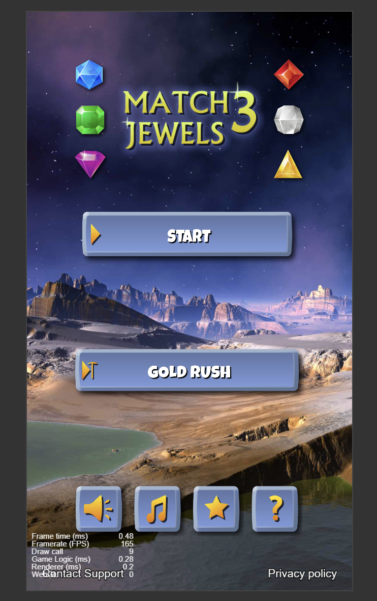
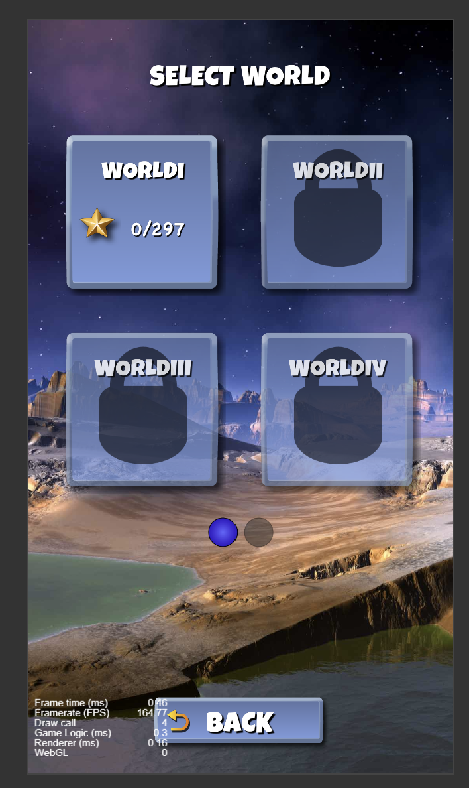
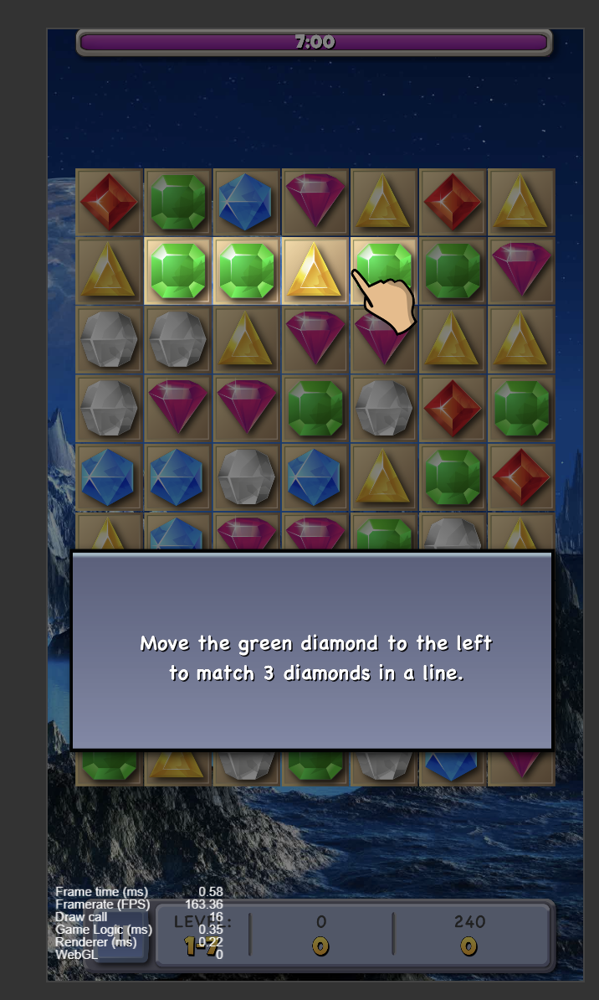

# 🍬 Smart 消消乐 — Cocos Creator 2.4.2 三消游戏

基于 **Cocos Creator 2.4.2** 开发的三消游戏。18 个 JavaScript 脚本、约 1250 行代码、4 个场景，完整走通 MVC 分层 + 事件总线 + 预制体弹窗，覆盖棋盘消除、连锁下落、格子耐久、新手引导、计时计分、暂停存档全流程。

---

## 📸 游戏截图

<table>
  <tr>
    <td align="center" width="50%">
      <b>🏠 开始界面</b><br>
      
    </td>
    <td align="center" width="50%">
      <b>🌍 世界选择</b><br>
      
    </td>
  </tr>
  <tr>
    <td align="center" colspan="2">
      <b>🎮 游戏主界面</b><br>
      
    </td>
  </tr>
</table>

---

## 游戏流程

```
StartScene            LevelSelectScene          WaveSelectScene          BestGameScene
开始界面      →       世界选择（8 个 WORLD）  →  关卡选择（每世界 99 关） →  三消主场景
标题 / 开始按钮        每页 4 个世界框            每页 9 个关卡              7×9 棋盘玩法
声音 / 音乐开关        分页球翻页                 三种关卡状态               含暂停面板
```

场景之间用页面列车式滑动动画衔接，无黑屏跳转。

---

## 核心机制

### 棋盘（BestGameModel · 193 行）

- 7 列 × 9 行，格子边长 92.43，共 6 种宝石（蓝 / 绿 / 紫 / 红 / 白 / 黄）
- 坐标换算：`cellX(col) = (col-3) × 92.43`、`cellY(row) = 407 - row × 92.43`
- 开局生成时做**两格前瞻去重**：填每个空格前先看左边两格和上边两格，同色就换色，保证初始棋盘不存在三连
- `trySwap` 交换后校验三连，不成立则自动换回
- `clearAndFall` 循环处理连锁：三连清空 → 背景降一级 → 同列宝石下落 → 顶部随机补新，直到棋盘无三连为止

### 格子耐久与胜利条件

每个格子有 0~3 共 4 级背景（`cell_left3 → cell_left2 → cell_left1 → cell_disabled`），每被消除一次降一级。全部格子降到 0 时判定胜利，从棋盘上方随机一列掉落一颗 GoalGem，落地后通过 `EventBus` 广播 `GameWin` 事件。

### 动画（BestGameView · 186 行）

Model 在计算时把每一步消除与下落记录进 `steps` 数组，View 逐步回放：

| 动画 | 实现方式 |
|------|----------|
| 交换 | 两颗宝石同时 `cc.tween` 滑到对方坐标（0.15 秒） |
| 交换失败 | 同一个函数再调用一次，两颗宝石原路滑回 |
| 消除 | 缩放至 0 后销毁节点 |
| 下落 | 同列宝石滑向新行，新宝石从棋盘上方落入 |
| 连锁 | `playNextStep` 依次播放记录下来的每一步 |

节点命名规则 `gem_行_列` / `bg_行_列`，动画按名字定位节点。

### 新手引导（三步）

| 步骤 | 弹窗 | 固定棋局 | 提示方式 |
|------|------|----------|----------|
| 1 | Tip1 | 绿 绿 黄 绿（第 2 行） | 手指在第 3、4 列之间来回拖动 |
| 2 | Tip2 | 紫 白 紫 紫 | 手指在第 6 行第 2、3 列之间拖动 |
| 3 | Tip3 | — | 胜利弹窗，点确认解锁并存档 |

两个操作教程共用同一张棋盘，切换教程时棋盘保持不动，只更换弹窗与手指；手指动画用 `repeatForever` 循环 去 → 回 → 停 0.2 秒。

### 计时与计分

- 倒计时 420 秒（7:00），进度条用 Sprite 的 `FILLED` 填充模式，靠 `fillRange` 驱动长度
- 每消除一颗宝石 10 分，消除与下落动画期间用 `busy` 标志锁住输入
- 最高分（`bestScore`）、当前世界（`currentWorld`）、世界内最高关卡（`wave_世界号_bestLevel`）写入 `localStorage`

---

## 场景一览

| 场景 | 脚本 | 说明 |
|------|------|------|
| **StartScene** | StartController / StartView / StartModel + BtnMove / BtnChange / DimondChange | 标题 + 开始按钮 + 声音 / 音乐开关，按钮浮动与宝石闪烁动效 |
| **LevelSelectScene** | LevelSelectController / LevelSelectView / LevelSelectModel | 8 个 WORLD（罗马数字 I~VIII），每页 4 个世界框，分页球翻页，未解锁弹出 LockedTip |
| **WaveSelectScene** | WaveSelectController / WaveSelectView / WaveSelectModel | 每个世界 99 关、每页 9 关，三种状态（已通关 / 新解锁 / 未解锁） |
| **BestGameScene** | BestGameController / BestGameView / BestGameModel + GamePause | 三消主场景，含暂停面板（继续 / 重开 / 菜单 + 声音 / 音乐开关） |

---

## 目录结构

```
assets/
├── Scences/                    4 个场景文件（.fire）
├── Scripts/
│   ├── EventBus.js             事件总线，跨层通信
│   ├── Page.js                 页面列车式滑动切页
│   ├── StartScene/             开始界面 MVC + 按钮动效
│   ├── LevelSelectScene/       世界选择 MVC
│   ├── WaveSelectScene/        关卡选择 MVC
│   └── BestGameScene/          游戏主场景 MVC + GamePause
└── resources/                  图片、字体、预制体
    ├── GameResources/Gem/      6 种宝石 + 4 级格子背景 + 手指
    ├── LoginResources/         开始界面素材
    ├── ReadyResources/         世界选择素材
    ├── WaveResources/          关卡选择素材
    ├── YuZhijian/              弹窗与页面预制体
    └── ziti/                   位图字体 + TTF 字体
```

---

## 技术栈

`Cocos Creator 2.4.2` · `JavaScript` · `Canvas 2D` · `MVC 分层` · `cc.tween 缓动动画` · `localStorage 存档`

## 运行

用 **Cocos Creator 2.4.2** 打开 `BestGameForever2` 目录，点击预览即可运行。