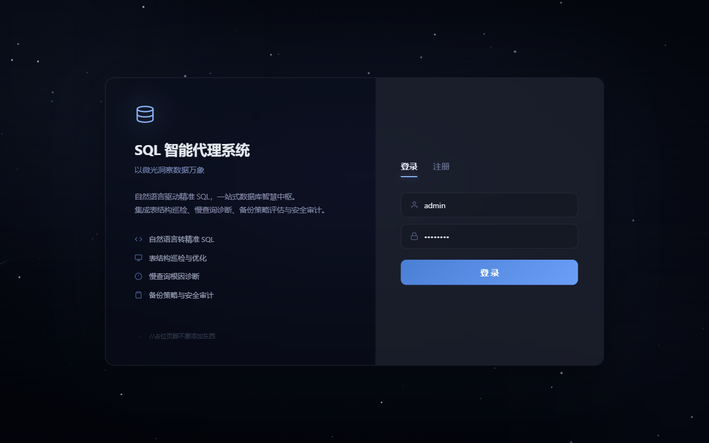
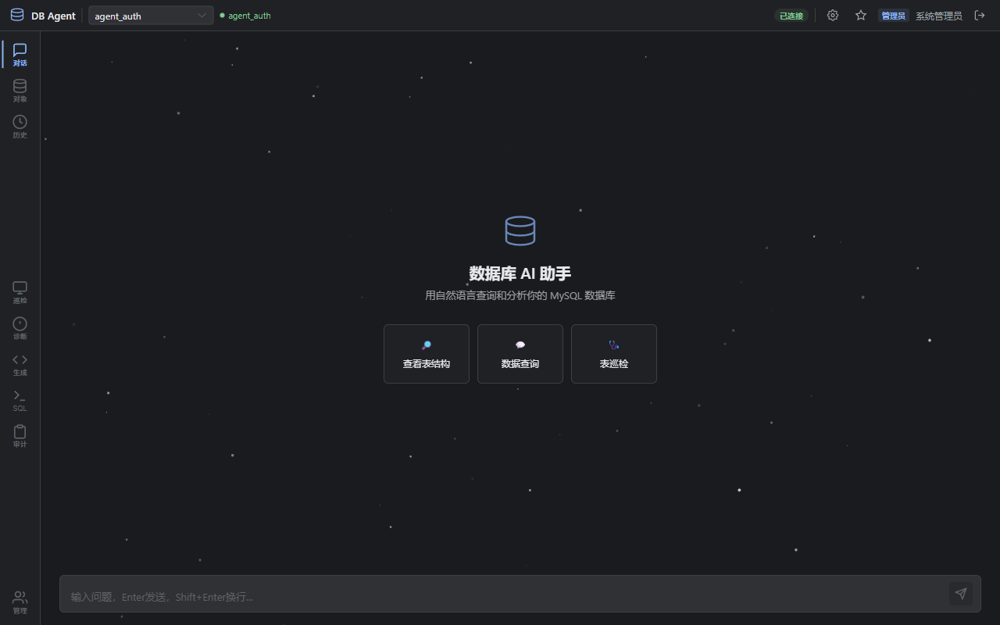
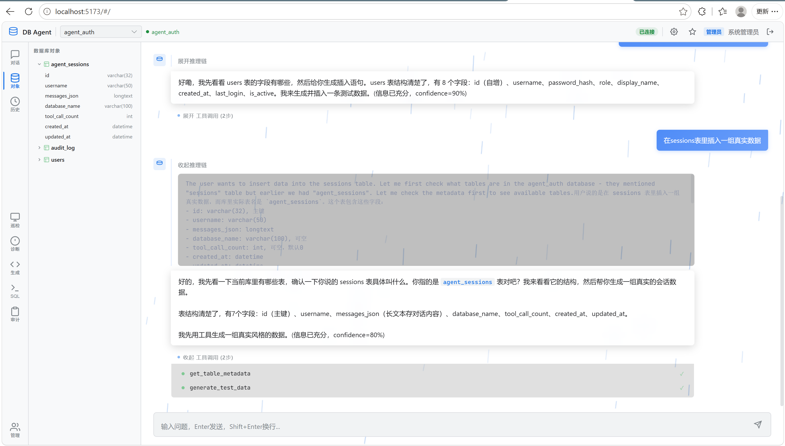
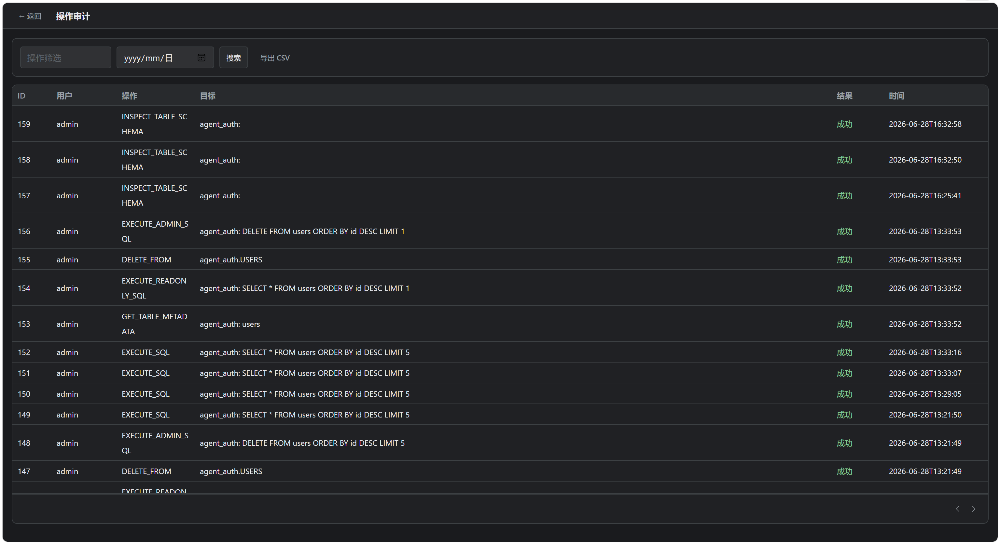
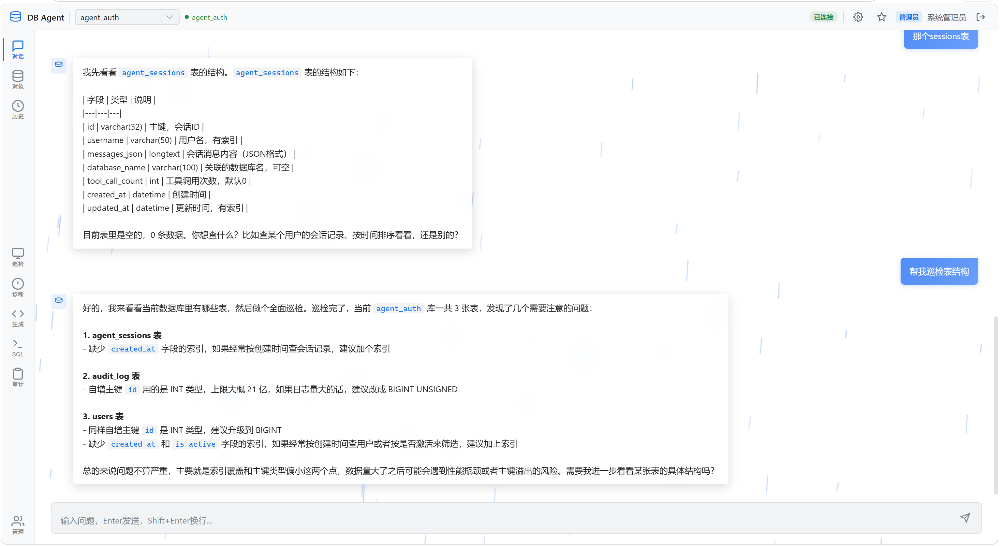

<div align="center">

# 🗄️ DB Agent — 大厂级 LLM Agent 全栈项目

[](https://python.org)
[](https://fastapi.tiangolo.com)
[](https://vuejs.org)
[](https://deepseek.com)
[](https://trychroma.com)
[](https://mysql.com)

**1,460 行纯自研代码｜12 个算法模块｜P0-P2 三级全落地｜零框架黑盒**

</div>

---


这是一个 **从零手写的 LLM Agent 全栈项目**——不做 LangChain/LlamaIndex 的 API 调用者，而是把 Agent 的 Loop Control、Memory、Multi-Agent Orchestration 三个核心技术全部自己实现了一遍。

---

## 一、项目定位

| 可能面试的岗位 | 本项目对应展示的能力 |
|-------------|------------------|
| **算法工程师（Agent方向）** | LLM Self-Eval 自主终止、Kahn 拓扑 DAG 调度、PER 优先经验回放、Levenshtein 自愈 |
| **后端工程师** | FastAPI 异步 API、连接池、JWT+RBAC、审计日志、SSE 流式、三层 SQL 安全沙箱 |
| **前端工程师** | Vue 3 Composition API、Canvas 星空粒子、Glassmorphism 设计系统、暗/亮双主题 |
| **全栈工程师** | 前后端全自研、端到端架构设计、模块化文件组织 |

---

## 二、技术架构

```
┌──────────────────────────────────────────────────────────┐
│  Vue 3 前端 (Composition API + Element Plus + ECharts)    │
│  Login.vue │ Chat.vue │ Settings.vue │ 6 个管理页面        │
├──────────────────────────────────────────────────────────┤
│  FastAPI 后端 (SSE 流式 + 30 个 REST 端点)                 │
│  JWT 认证 │ RBAC 双角色 │ CORS │ 审计日志 │ 速率限制       │
├──────────────────────────────────────────────────────────┤
│   Agent 调度层 (chat_stream_generator)                   │
│  Orchestrator → TokenBudget → AdaptiveLoop → Tools       │
├──────────────┬───────────────┬────────────────────────────┤
│ Agent 算法层  │ Memory 层     │ 安全层                     │
│ LLMSelfEval  │ WorkingMemory │ 三层 SQL 沙箱              │
│ SelfHealing  │ Episodic PER  │ 连接池 (PooledDB)          │
│ DepAnalyzer  │ RunningSummary│ Guardrails 防幻觉          │
│ Kahn Topo    │ RAG ChromaDB  │ Human-in-loop 审批         │
├──────────────┴───────────────┴────────────────────────────┤
│  MySQL (业务DB + agent_auth) │ DeepSeek API │ ChromaDB    │
└──────────────────────────────────────────────────────────┘
```

---

## 三、Agent 算法详解（面试核心内容）

### 3.1 Agent Loop：双层终止 + 自愈矩阵

**五维规则层** + **LLM 语义层**的混合终止策略：

```
Token Budget 超限 → 强制停 │ 最大轮次达到 → 强制停 │ 连续失败 → 强制停
         ↓
  规则层允许继续 → LLM Self-Evaluator 评估信息充分性
         ↓
      输出 JSON: {can_answer, confidence, missing}
         ↓
    confidence > 0.65 → 主动终止 │ 否则继续探索
```

| 模块 | 算法/技术 | 文件 | 参考 |
|------|---------|------|------|
| `TokenBudget` | 分步降级经济模型（正常→预警→临界→超限） | `loop_engine.py` | — |
| `AdaptiveLoopController` | 五维信号联合判断（指纹冗余/连续失败/停滞/充分性） | `loop_engine.py` | AutoGPT Self-Termination |
| `LLMSelfEvaluator` | Epistemic Uncertainty + 规则兜底 + JSON 容错 | `self_evaluator.py` | Self-Refine (Meta 2023) |
| `SelfHealingToolExecutor` | 5 策略自愈矩阵 + **Levenshtein 编辑距离列名修正** | `loop_engine.py` | Code Repair |

**面试话术**："规则负责 saying 'stop because you must'，LLM 负责 saying 'stop because you're done'。这在 Agent 领域叫 Epistemic Uncertainty Estimation。"

---

### 3.2 Multi-Agent：DAG 编排 + Kahn 拓扑排序

**不是简单的意图路由**，而是完整的任务分解→调度→聚合闭环：

```
用户: "找出最大的表并分析它的索引"
         ↓
   Orchestrator 分解为 DAG
         ↓
   [Task-1: analyst 找最大表] ──→ [Task-2: optimizer 分析索引]
         ↓
   Kahn 拓扑排序分层 → 同层并行 (asyncio.gather)
         ↓
   SharedWorkingMemory 共享表元数据
         ↓
   AgentMailbox (Actor Model) 发送结果
         ↓
   聚合 → 格式化为最终回答
```

| 模块 | 算法 | 文件 | 参考 |
|------|------|------|------|
| `AgentOrchestrator` | LLM 任务分解 + DAG 构建 + 规则回退 Plan | `orchestrator.py` | AutoGen (Microsoft 2023) |
| `ToolDependencyAnalyzer` | **Kahn 算法拓扑排序** → 并行批次生成 | `tool_dependency.py` | 编译原理 ILP 调度 |
| `SharedWorkingMemory` | Sub-Agent 间共享表元数据 & 发现结果 | `orchestrator.py` | LangGraph StateGraph |
| `AgentMailbox` | 异步消息队列 (Actor Model 简化实现) | `orchestrator.py` | AutoGen Inter-Agent |

**面试话术**："我用 Kahn 算法做工具调用的拓扑排序——把 LLM 返回的多个工具调用构建成 DAG 依赖图，分层后同层 asyncio.gather 并行。复杂任务由 Orchestrator 拆分子任务、按依赖关系调度 Sub-Agent、聚合结果。参考了 Microsoft AutoGen。"

---

### 3.3 Agent Memory：三层架构 + PER 经验回放

```
Layer 1: Working Memory (AgentWorkingState)
    plan / explored_tables / findings / last_query_sql
    ↓
Layer 2: Episodic Memory (PrioritizedEpisodicMemory)
    TD-error 计算优先级 → heapq 采样 → System Prompt 注入
    ↓
Layer 3: RAG Knowledge Base (ChromaDB + Sentence-Transformers)
    13 条预置知识 + 自动沉淀 + 语义检索
```

| 模块 | 算法 | 文件 | 参考 |
|------|------|------|------|
| `AgentWorkingState` | 代码层维护 plan/explored_tables/findings，LLM 只读 | `loop_engine.py` | — |
| `PrioritizedEpisodicMemory` | **TD-error 优先经验回放** (PER 算法迁移) | `episodic_memory.py` | PER (DeepMind 2016) |
| `SummaryGenerator` | 自动对话摘要 + 消息裁剪 | `scheduler.py` | — |
| `_auto_precipitate_knowledge` | 成功对话自动沉淀到 ChromaDB | `scheduler.py` | HippoRAG (OSU 2024) |
| RAG 知识库 | 13 条 MySQL 优化知识 + ChromaDB 语义检索 | `knowledge_base.py` | — |

**面试话术**："我把 DRL 的 PER 算法迁移到对话场景——每次对话结束后自动记录工具链和意图，基于 TD-error 计算优先级。后续对话优先采样高 TD-error 的经验注入 System Prompt，实现渐进式自我提升。"

---

### 3.4 COT 思维链 + 并行调度

| 模块 | 说明 |
|------|------|
| `reasoning_content` 提取 | DeepSeek R1 的 CoT 思维链，通过 SSE `type:reasoning` 事件推送前端 |
| `execute_tools_parallel` | Kahn 拓扑分层后，同层工具用 `asyncio.gather` 并行执行 |

---

## 四、安全架构

### 三层 SQL 安全沙箱（纵深防御）

```
请求 → JWT 认证 → RBAC 角色检查
         ↓
Layer 1: 类型检查 — 仅允许 SELECT/EXPLAIN/DESCRIBE/SHOW
         ↓
Layer 2: 关键字黑名单 — DROP/ALTER/INSERT/CREATE/TRUNCATE...
         ↓
Layer 3: 注入特征检测 — 堆叠查询/UNION/盲注/文件写入/编码绕过 (11 条规则)
         ↓
   只读账号强制 (agent_readonly) + 自动 LIMIT + 最小化查询超时
```

### 其他安全组件

| 组件 | 说明 | 文件 |
|------|------|------|
| **JWT + BCrypt** | HS256 签名，8h 过期，密码哈希 | `auth/security.py` |
| **RBAC** | admin/reader 双角色，`Depends(require_admin)` 依赖注入 | `auth/security.py` |
| **审计日志** | 全操作追溯，按用户/时间/操作筛选，CSV 导出 | `auth/database.py` |
| **自动备份** | DROP/ALTER 前 mysqldump，一键恢复 | `security/backup_manager.py` |
| **Guardrails** | 防幻觉：回答提到的表名必须 ∈ explored_tables | `agent/guardrails.py` |
| **Human-in-the-loop** | DROP/TRUNCATE/ALTER 需审批队列确认 | `agent/guardrails.py` |
| **连接池** | DBUtils PooledDB，8 连接 + 自动 ping + 超时 | `security/connection_pool.py` |

---

## 五、工程能力展示

| 能力 | 实现 |
|------|------|
| **Cost Tracking** | 每次对话实时计算 Token 费用（按模型真实定价） |
| **OpenTelemetry** | 可选集成，LLM/工具/RAG 独立 Span |
| **端到端评估** | 20 个测试用例的静态评估 + `evaluate_e2e()` 真实运行 Agent |
| **优雅降级** | RAG 模型加载失败不影响对话功能；OTel Collector 不可用时静默跳过 |
| **模块化组织** | 12 个独立 Agent 模块 + 8 个独立工具 + 安全/认证/RAG 分层 |
| **SSE 流式** | DeepSeek Streaming API，reasoning_content CoT 解析 |

---

## 六、功能展示

### 核心功能

| 功能 | 说明 |
|------|------|
| 🧠 自然语言→SQL | 自动查元数据 → 生成查询 → 执行 → 解释结果 |
| 🔍 表结构巡检 | 扫描缺失主键、无索引大表、命名不规范 |
| ⚡ 慢查询诊断 | EXPLAIN 分析 + 智能触发优化建议 |
| 🧪 测试数据生成 | 基于 Faker 推测列类型，生成仿真 INSERT |
| 📊 SQL 编辑器 | 内置 Monaco 风格编辑器 + 格式化 + 执行 |
| 🔐 用户管理 | 管理员可创建/禁用/删改用户和角色 |

### 截图展示


| 截图 | 内容 | 文件路径 |
|------|------|---------|
| 1 | 登录页 — 暗色星空背景 + 毛玻璃卡片 + 左右分栏 | `screenshots/login.png` |
| 2 | 对话主界面 — AI 助手 + 对象浏览器 + SQL 编辑器 | `screenshots/chat.png` |
| 3 | 对话主界面 — AI 助手 + 对象浏览器 + SQL 编辑器 | `screenshots/chat2.png` |
| 4 | CoT 思维链+工具调用过程 — AI 思考过程 | `screenshots/tools.png` |
| 5 | 安全保障 — 审计日志 + 用户管理 | `screenshots/admin.png` |
| 6 | 表巡检 — 反模式检测结果 | `screenshots/inspect.png` |
| 7 | 设置界面 — 自定义体验 | `screenshots/settings.png` |

<p align="center">
  
  
  <br><br>
  
  
  <br><br>
  
  
</p>

---

## 七、项目结构

```
backend/agent/  (12 个模块，~430+450=880 行主体算法)
  loop_engine.py         核心算法：TokenBudget、AdaptiveLoop、SelfHealing、Cache、WorkingState
  scheduler.py            主循环：SSE 流式对话、工具调度、模块集成、自动沉淀
  session_manager.py      会话管理：CRUD、智能裁剪、TTL 清理、MySQL 持久化
  self_evaluator.py       LLM 自评终止判断 (Epistemic Uncertainty)
  episodic_memory.py      PER 优先经验回放 + Prompt 注入
  tool_dependency.py      Kahn 拓扑排序 → 并行批次生成
  orchestrator.py         Multi-Agent 编排、DAG 调度、SharedMemory、Mailbox
  agent_registry.py       Agent 注册中心 + Embedding 意图路由器
  guardrails.py           防幻觉输出验证 + DROP/ALTER 审批队列
  cost_tracker.py         Token 成本追踪（按模型真实定价）
  telemetry.py            OpenTelemetry Span 包装器

backend/api/
  routes.py               30 个 REST 端点（认证/对话/工具/管理/审计/导出）
backend/auth/
  security.py             JWT + BCrypt + RBAC 依赖注入
  database.py             用户 CRUD + 审计日志 MySQL 持久化
backend/security/
  sql_validator.py        三层 SQL 安全沙箱
  connection_pool.py      DBUtils PooledDB 连接池
  backup_manager.py       高危操作自动备份/恢复
backend/tools/
  8 个独立工具文件        元数据/SQL/EXPLAIN/巡检/测试数据/格式化/管理员
backend/eval/
  evaluate.py            静态评估 + evaluate_e2e() 端到端
  eval_cases.json         20 个测试用例
```

---

## 八、快速开始

```bash
# 后端
cd backend
pip install -r requirements.txt
cp .env.example .env          # 编辑填入 DeepSeek API Key + MySQL 信息
python -m uvicorn main:app --host 0.0.0.0 --port 8000 --reload

# 前端
cd frontend
npm install
npm run dev                    # → http://localhost:5173
```

**默认账户**：admin / admin123（管理员）｜需要 MySQL 8.0+ 和 DeepSeek API Key
