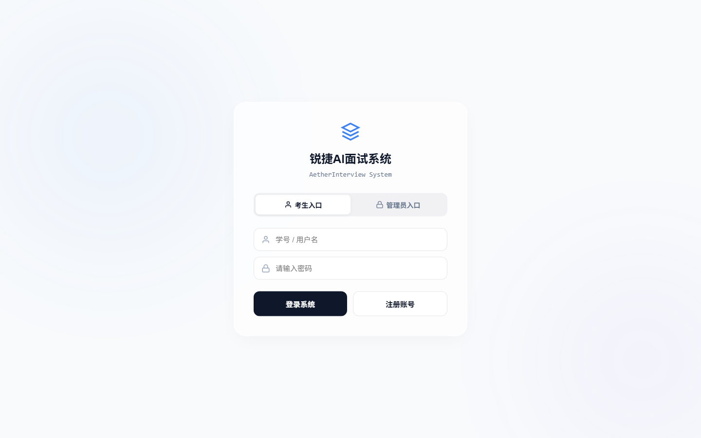
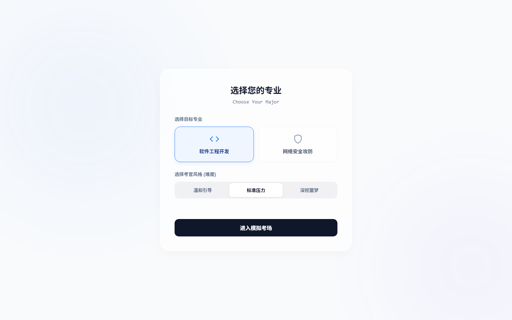
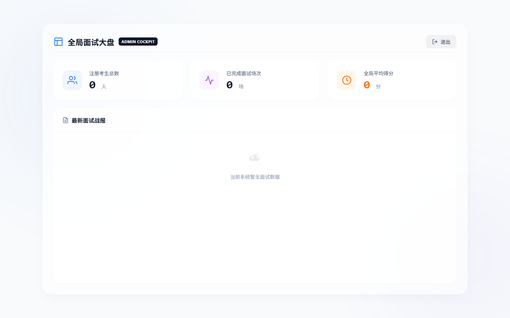
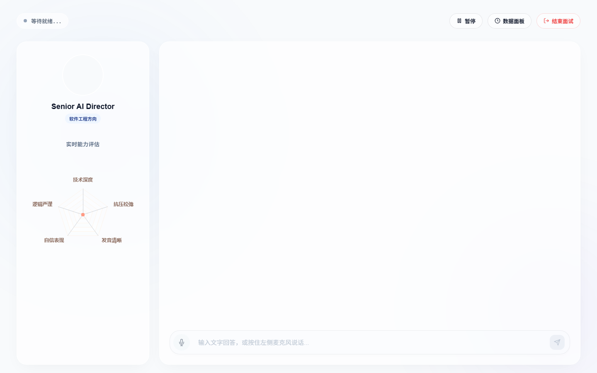

# 🎙️ SmartInterview — AI 模拟面试系统（Java + Python AI + Vue 3）

[](https://java.com)
[](https://spring.io)
[](https://python.org)
[](https://fastapi.tiangolo.com)
[](https://vuejs.org)
[](https://deepseek.com)

全栈 AI 模拟面试平台 · WebSocket 实时交互 · Faster-Whisper GPU ASR · librosa 声学三指标评分 · ChromaDB RAG 检索增强 · DeepSeek 内容评分 · CosyVoice TTS 语音合成

---

## 📸 完整运行截图

<table>
  <tr>
    <td align="center" width="50%">
      <b>① 登录注册</b><br>
      
    </td>
    <td align="center" width="50%">
      <b>② 专业与难度选择</b><br>
      
    </td>
  </tr>
  <tr>
    <td align="center">
      <b>③ 管理员仪表盘</b><br>
      
    </td>
    <td align="center">
      <b>④ AI 面试主界面</b><br>
      
    </td>
  </tr>
</table>

---

## 系统架构

```
┌─────────────────────────────────────────────────────────────────────┐
│  Vue 3 前端 (Element Plus + ECharts)                               │
│  InterviewBoard.vue │ StudentDashboard.vue │ AdminDashboard.vue    │
├─────────────────────────────────────────────────────────────────────┤
│  Java Spring Boot 后端 — WebSocket 服务端                           │
│  InterviewWebSocketServer │ AiIntegrationService │ 3 Controller     │
├─────────────────────────────────────────────────────────────────────┤
│  Python AI 引擎 (FastAPI)                                           │
│  ASR (Whisper) → 声学评分 (librosa) → RAG (ChromaDB) → TTS (CosyVoice)│
├─────────────────────────────────────────────────────────────────────┤
│  MySQL (smart_interview) │ DeepSeek API │ ChromaDB 向量库          │
└─────────────────────────────────────────────────────────────────────┘
```

---

## 核心功能

### 1. WebSocket 实时面试引擎（InterviewWebSocketServer.java · 353 行）

**面试全流程处理**：

```
用户连接 /ws/interview/{userId}/{jobRole}/{difficulty}
  │
  ├── 查询未完成会话 → 复用或新建 InterviewSession
  │
  ├── 用户文本回答
  │     └── @OnMessage text → AiIntegrationService.analyzeContentAsync()
  │           ├── DeepSeek 内容评分（score 0-100）
  │           ├── AI 评语生成（feedback）
  │           └── 追问题目生成（next_question）
  │
  ├── 用户音频回答  
  │     └── @OnMessage ByteBuffer → 保存 WebM → Python AI 引擎
  │           ├── POST /api/analyze/audio  → ASR + 声学评分
  │           └── POST /api/analyze/content → RAG 检索 + 评分
  │
  └── 每轮存储 InterviewTurnRecord（question / answer / score / feedback / audio_url）
       → 返回前端雷达图更新（紧张度/自信度/清晰度/内容评分四维）
```

| 特性 | 实现 |
|------|------|
| 会话复用 | 按 userId + jobRole 查询 status=0 的未完成会话，自动续面 |
| 异步评分 | `@Async` + `CompletableFuture` 非阻塞执行 AI 分析 |
| 文本/音频双通道 | `@OnMessage` 方法重载区分 String 和 ByteBuffer |

### 2. 语音识别（Faster-Whisper GPU）

```python
model = WhisperModel("small", device="cuda", compute_type="float16")
segments, info = model.transcribe(wav_path, beam_size=5, language="zh")
```

- GPU 加速（`cuda` + `float16` 半精度推理）
- WebM → WAV 转换（`pydub.AudioSegment`）
- `beam_size=5` 束搜索提升识别精度
- 临时音频自动清理，永久归档至 `static/audio/{uuid}.wav`

### 3. 声学评分（audio_model.py · 86 行）

基于 `librosa` 的三个声学维度的量化评分：

| 指标 | 计算方式 | 特征提取 | 归一化 |
|------|---------|---------|--------|
| **紧张度** | 基频 `librosa.yin` 标准差 + 语速变异系数 | 高频抖动越大越紧张 | `tanh` 归一化 0-100 |
| **自信度** | 基频均值（`np.mean(f0)`）+ 有效语音占比 | 平稳低频+高语音占比=自信 | 线性映射 0-100 |
| **清晰度** | MFCC 特征标准差 + 过零率 | 高 MFCC 方差+稳定过零=清晰 | 归一化 0-100 |

SPL 信噪比：`np.mean(y_speech**2) / np.mean(y_silence**2)`

默认兜底：有效语音 < 0.8s 返回 `{nervousness: 85, confidence: 30, clarity: 20}`

### 4. RAG 知识库（rag_engine.py · 131 行）

| 组件 | 选型 |
|------|------|
| 嵌入模型 | `BAAI/bge-small-zh-v1.5` (HuggingFace) |
| 向量存储 | ChromaDB（`chroma_db/` 目录持久化） |
| 文档切分 | `RecursiveCharacterTextSplitter` |
| 数据源 | `interview_dataset.json` + `knowledge_base/*.pdf` + `*.txt` |
| 检索 | `similarity_search` 返回 Top-K 标准答案 |

构建混合知识库：JSON 结构化题库 → Document(page_content) + Chroma.embeddings → 向量化。非结构化 PDF/TXT 分块后同样加入 Chroma。

### 5. 大模型内容评分（AiIntegrationService.java · 373 行）

```java
@Async
public CompletableFuture<JSONObject> analyzeContentAsync(
    String userAnswer, String jobRole, String question, 
    int lastScore, String difficulty)
```

- 调用 DeepSeek API 进行面试回答评估
- 返回 JSON：`{score, feedback, next_question}`
- 支持 `run()` 接口执行批量或预评分
- 结合 RAG 检索的标准答案作为评判参考

### 6. TTS 语音合成

`POST /api/tts/generate` → CosyVoice 引擎 → `{status, data: {audio_base64}}`

默认音色：`BV007_streaming`

### 7. 前端组件

| 组件 | 说明 |
|------|------|
| `InterviewBoard.vue`（40KB） | 核心面试面板：WebSocket 连接、音视频录制、实时反馈、追问对话 |
| `StudentDashboard.vue`（30KB） | 学生仪表盘：历史面试记录、各维度评分趋势 |
| `AdminDashboard.vue`（20KB） | 管理端：系统监控、题库管理、用户管理 |
| `RadarChart.vue`（1.5KB） | ECharts 雷达图：紧张度/自信度/清晰度/内容评分四维可视化 |
| `Nailong.vue`（2.8KB） | 奶龙助手动画组件（Canvas 驱动） |

---

## 项目结构

```
SmartInterview_Project/
├── backend/                           Java Spring Boot
│   ├── src/main/java/com/smart/interview/
│   │   ├── config/WebSocketConfig.java         WebSocket 端点注册
│   │   ├── websocket/InterviewWebSocketServer.java   353 行，核心 WebSocket
│   │   ├── service/AiIntegrationService.java        373 行，DeepSeek + AI
│   │   ├── controller/
│   │   │   ├── AdminController.java         管理员 API
│   │   │   ├── DashboardController.java     仪表盘 API
│   │   │   └── UserController.java          用户 API
│   │   ├── entity/
│   │   │   ├── InterviewSession.java        面试会话实体
│   │   │   ├── InterviewTurnRecord.java     面试轮次记录实体
│   │   │   └── SysUser.java                 系统用户实体
│   │   └── mapper/                          3 个 MyBatis-Plus Mapper
│   ├── pom.xml                              Spring Boot 3 + MyBatis-Plus
│   └── resources/application.yml            配置
├── frontend/                           Vue 3 前端
│   ├── src/
│   │   ├── components/
│   │   │   ├── InterviewBoard.vue      40KB，面试面板
│   │   │   ├── StudentDashboard.vue    30KB，学生面板
│   │   │   ├── AdminDashboard.vue      20KB，管理面板
│   │   │   ├── RadarChart.vue          1.5KB，雷达图
│   │   │   └── Nailong.vue             2.8KB，奶龙动画
│   │   ├── App.vue / main.js / style.css
│   │   └── assets/
│   ├── package.json / vite.config.js
│   └── public/                          图标 + WebM 动画
└── ai_engine/                          Python AI 引擎
    ├── main.py                         155 行，FastAPI + Whisper ASR
    ├── audio_model.py                  86 行，librosa 声学评分
    ├── rag_engine.py                   131 行，ChromaDB + RAG
    ├── tts_engine.py                   CosyVoice TTS
    ├── chroma_db/                      向量知识库持久化
    ├── knowledge_base/                 PDF/TXT 原始文档
    ├── static/audio/                   音频文件归档
    └── requirements.txt                Python 依赖
```

---

## 快速开始

```bash
# 1. Python AI 引擎（需要 NVIDIA GPU + CUDA）
cd ai_engine
pip install -r requirements.txt
python main.py                    # http://localhost:8000

# 2. Java 后端
cd backend
./mvnw spring-boot:run            # http://localhost:8080

# 3. Vue 前端
cd frontend
npm install
npm run dev                       # http://localhost:5173
```

**环境要求**：MySQL `smart_interview` 库（`interview_session`、`interview_turn_record`、`sys_user` 表）、DeepSeek API Key、NVIDIA GPU（推荐，非必需）。

---

## 技术栈

| 层 | 技术 |
|----|------|
| 后端框架 | Java 17 · Spring Boot 3 · MyBatis-Plus · WebSocket |
| AI 引擎 | Python 3.11 · FastAPI · Faster-Whisper · librosa |
| 知识库 | ChromaDB · LangChain · BAAI/bge-small-zh-v1.5 |
| LLM | DeepSeek Chat API（内容评分 + 追问） |
| TTS | CosyVoice（本地语音合成） |
| 前端 | Vue 3 · Element Plus · ECharts · Vite |
| 数据库 | MySQL 8.0（MyBatis-Plus ORM） |
