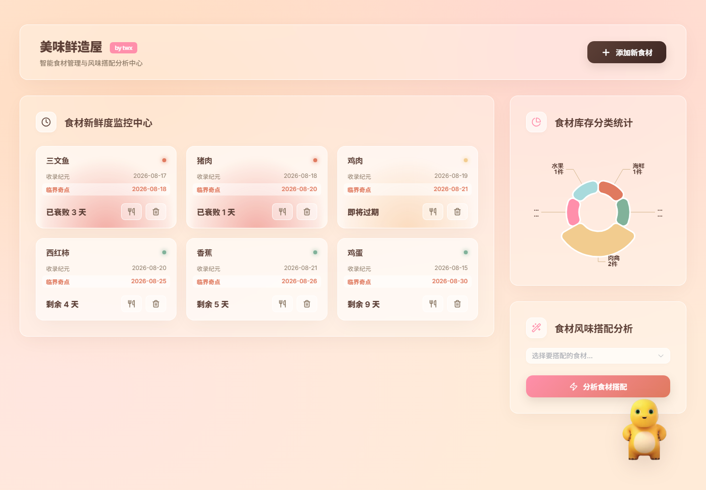
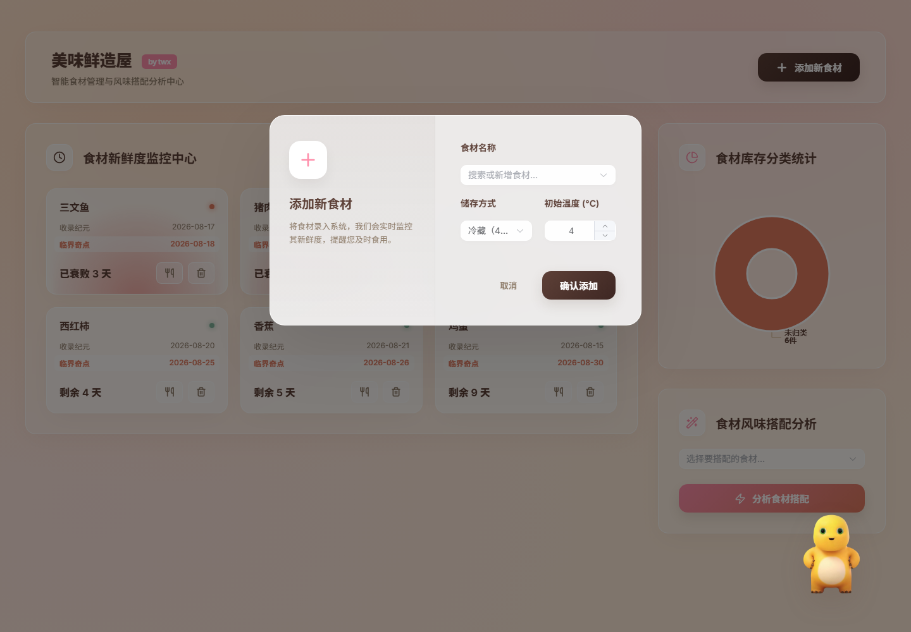
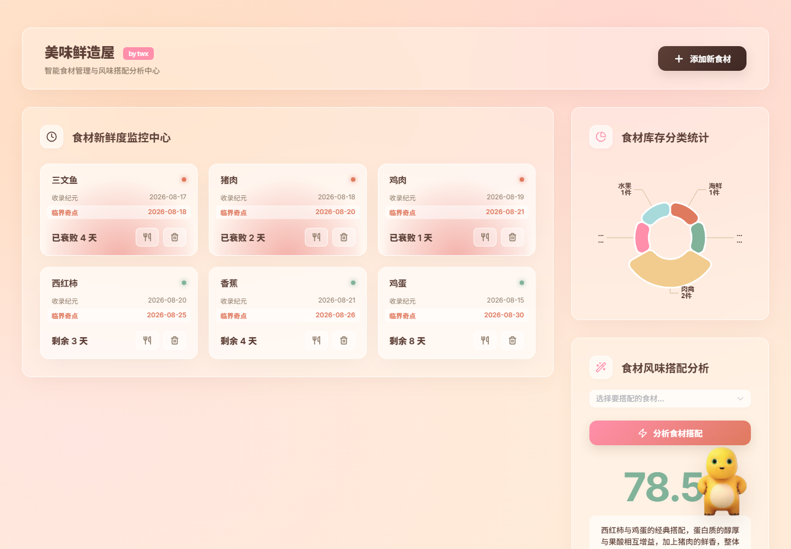

# 🧊 SmartPantry — 智能冰箱管理系统（Java + Python AI + Vue 3）

基于 Java Spring Boot + Python AI 引擎 + Vue 3 的全栈智能冰箱系统。  
支持食材管理、AI 新鲜度预测、黑暗料理评分、本地 LLM 零样本食材特征提取（Qwen 2.5-1.5B-Instruct）。  
后端 Spring Boot 3 + MyBatis-Plus + MySQL；AI 引擎 FastAPI + PyTorch；前端 Vue 3 + Element Plus + ECharts。

---

## 📸 界面预览（统一缩放适配 · 桌面 1440×1000）

> 3 张截图均为 `1440×1000` 桌面尺寸，用 HTML `` 标签三列等宽并排。

<table>
  <tr>
    <td align="center" width="33%">
      <b>食材新鲜度监控中心</b><br>
      
    </td>
    <td align="center" width="33%">
      <b>添加新食材弹窗</b><br>
      
    </td>
    <td align="center" width="33%">
      <b>食材风味搭配分析</b><br>
      
    </td>
  </tr>
  <tr>
    <td align="center">主面板：食材按过期日期排序，卡片色阶随临期/过期变化</td>
    <td align="center">Element Plus 自定义双栏弹窗，玻璃拟物风格</td>
    <td align="center">多食材组合打分（味觉和谐度 0-100）</td>
  </tr>
</table>

---

## 🧱 技术架构

```
Vue 3 前端  ──HTTP──▶  Java Spring Boot 后端  ──JDBC──▶  MySQL (smart_pantry)
                          │                                  ├── ingredient_dict  字典
                          │                                  └── user_pantry      冰箱
                          └──HTTP──▶  Python AI 引擎 (FastAPI :8000)
                                       ├── Qwen 2.5-1.5B-Instruct 本地 LLM
                                       ├── ShelfLifePredictor  (PyTorch FC 5→64→32→1)
                                       └── 5 维风味向量张量 + 余弦相似度
```

---

## ✨ 核心功能

### 1. 食材入库（Java → AI 联动）

`POST /api/pantry/add` 接收前端的 `ingredientInput`（前端用 Element Plus `filterable allow-create` 实现**搜索/新建合一**的 select）：

- **旧食材**（`Integer`）：按 id 查 `ingredient_dict` 复用记录
- **新食材**（`String`）：调 AI Engine → `extractIngredientFeatures()` → LLM 零样本分析类别和保鲜期 → 自动写库，实现**认知自我扩充**

入库后调 AI-1 `predictFreshness()` 预测变质日期，写入 `user_pantry.predicted_expire_date`。

### 2. AI 新鲜度预测（PyTorch 全连接网络）

```python
class ShelfLifePredictor(nn.Module):
    # 输入 5 维: [cat_id, base_shelf_life, storage_type, temp, initial_status]
    # 输出: 可存放天数 (float)
    nn.Linear(5, 64)  →  ReLU  →  nn.Linear(64, 32)  →  ReLU  →  nn.Linear(32, 1)
```

`/api/ai/predict_freshness` 接收 5 维特征，输出浮点天数；后端再 `LocalDate.now().plusDays(...)` 写入过期日期。

### 3. 黑暗料理评分（5 维风味向量余弦相似度）

`/api/ai/predict_harmony` 对食材组合的 5 维风味向量 `[甜, 咸, 酸, 辣, 异味]` 做两两余弦相似度 → 归一化到 0-100。  
基础库在 `flavor_cache.json`，**包含 19 种食材**（西红柿 `[4,1,5,0,0]`、鲱鱼罐头 `[0,9,2,0,10]` 等）。

| 分数区间 | 评语 |
| --- | --- |
| > 80 | 绝妙搭配，快去大显身手！ |
| 55 – 80 | 中规中矩，可以一试 |
| 35 – 55 | 勉强能吃，有点怪 |
| 0 | 💥 严重生化武器警告！不可食用！ |
| 0 < x ≤ 35 | 💥 暗黑料理预警！极度容易拉肚子 |

### 4. 本地 LLM 零样本特征提取（Qwen 2.5-1.5B-Instruct）

`/api/ai/extract_features` 接收食材名称，调用本地通义千问 1.5B 模型进行零样本分析：
- `temperature=0.01` 控温度
- `max_new_tokens=100` 控生成长度
- JSON 正则提取 + 错误兜底
- 自动从 MySQL `ingredient_dict` 拉取数据库食材 → 遍历检测缺失特征 → 调 LLM 补全 → 写回 `flavor_cache.json`

### 5. 食材管理 REST API

| API | 方法 | 功能 |
| --- | --- | --- |
| `/api/pantry/my-fridge` | GET | 查冰箱在库食材，按 `predicted_expire_date` 升序 |
| `/api/pantry/consume/{id}` | DELETE | 食用标记（status=1） |
| `/api/pantry/discard/{id}` | DELETE | 丢弃标记（status=2） |
| `/api/pantry/dict` | GET | 食材字典库 |
| `/api/pantry/add` | POST | 入库（自动判断新旧食材） |
| `/api/pantry/check-recipe` | POST | 风味搭配评分（ids: number[]） |

---

## 🎨 前端实现要点（Vue 3 + Element Plus + ECharts）

> 以下要点全部在 `smart-pantry-frontend/src/` 的真实源码中可见，**未作虚构**。面试可对照源码讲解。

### 1. Glassmorphism 设计系统
- 全部颜色、半径、阴影抽到 `assets/theme.css` 的 CSS 变量（`--primary-color` / `--glass-bg` / `--glass-border` / `--sharp-radius` / `--glass-shadow`）
- 暖色治愈系配色：深咖 `#5D4037`、珊瑚粉 `#FF8FAB`、莫兰迪绿 `#81B29A`、暖阳黄 `#F2CC8F`、陶土红 `#E07A5F`
- 背景层 `.aurora-bg` 用三段 `radial-gradient` 叠加，**纯 CSS 实现流体弥散光**（零图片资源）

### 2. Glassmorphism + Premium 按钮
- 玻璃拟物：`backdrop-filter: blur(30px) saturate(120%)` + 1px 纯白高光描边
- 双线性渐变按钮（`linear-gradient(135deg, #5D4037 0%, #3E2723 100%)`），hover 时 `translateY(-4px) scale(1.02)`，外加 `::before` 高光横扫（`transform: translateX(-100%) → 100%` + 0.6s 过渡）

### 3. 状态分级别的卡片（**不靠组件库，自己写**）
`components/MaterialCard.vue`：
- 计算属性 `diffDays = ceil((expireDate - now) / day)`，再 `levelClass` 映射到 `safe` / `warning` / `danger`
- 临期/过期卡片在底部用 `@keyframes soft-breathe` 跑呼吸光（橙黄 / 红色 `radial-gradient`，opacity + scale + blur 三属性一起动）
- 倒计时文案三态：`已衰败 N 天` / `即将过期` / `剩余 N 天`
- 行内 `提取能量` / `销毁物质` 两个 icon 按钮（lucide-vue-next），hover 边框/图标着色与状态色一致

### 4. Element Plus 自定义弹窗
- 用 `:deep(.premium-dialog)` 覆盖 Element Plus 默认遮罩与圆角，把 620px 弹窗改成**左右两栏**：
  - 左侧 200px `p-dialog-side`：图标 + 标题 + 说明文案
  - 右侧表单：食材 select（filterable allow-create）、储存方式（冷冻/冷藏/常温）、初始温度（`el-input-number`）
- 弹窗本身也是 `backdrop-filter: blur(40px)` 玻璃面板，色卡与全局一致

### 5. ECharts 玫瑰图（自定义 tooltip）
- `echarts.init(chartRef)`，series `type: pie, roseType: radius, itemStyle.borderRadius: 10`
- 自定义 `tooltip.formatter` 直接渲染 HTML：分类标题 + 食材明细（名称 / 份数），`trigger: 'item'`
- `watch(fridgeItems, ...)` 深监听 + `nextTick(updateChart)`，保证 CRUD 后图表自动刷新
- 6 色调色板与全局 CSS 变量语义一致

### 6. 风味搭配实时打分
- 多选 `el-select multiple` 选择食材 → 点击 `分析食材搭配` → POST `/api/pantry/check-recipe`（传 `ids: number[]`）
- 返回文案用正则 `味觉和谐度：([\d.]+)分` 解析分数，`computed` 算颜色档（≥75 绿 / ≥50 黄 / <50 红）
- 结果区用 `transition name="fade"`（透明度 + translateY 一起动）做出现动画
- 命中高分（≥70）触发右下角奶龙 mascot 切换到 `nailongdaxiao.webm` 开心动画

### 7. 浮窗 mascot 互动
- 右下角 `position: fixed` 浮窗，图片 `nailong.png` + 两段 `webm` 视频（happy / warning）
- 点击 / 高分 / 报警时切换 `mascotState`，`setTimeout` 4 秒后回到 idle
- `float-anim`：`@keyframes smooth-float` 4s 上下 10px 缓动

### 8. 关键工程细节
- 所有后端请求走 `axios`，base URL 集中在 `API_BASE = 'http://localhost:8080/api/pantry'`，CORS 由后端 `@CrossOrigin` 解决
- 操作反馈用 `ElMessage`（普通提示）+ `ElNotification`（成功通知）两层
- 入口 `main.js` 仅 `app.use(ElementPlus)` + 全局主题 CSS，**未引入 router/pinia**（单页够用，保持依赖精简）
- 表单状态用 `reactive` / `ref`，无冗余 store

---

## 🗂️ 项目结构

```
SmartPantry/
├── smart-pantry-backend/                Java Spring Boot
│   ├── src/main/java/com/pantry/
│   │   ├── SmartPantryApplication.java  入口
│   │   ├── controller/PantryController.java     REST API
│   │   ├── service/AiIntegrationService.java    AI 引擎调用 + 兜底
│   │   ├── entity/                              数据实体
│   │   ├── mapper/                              MyBatis-Plus 映射
│   │   └── resources/application.yml            配置（端口 8080、MySQL、AI 引擎 URL）
│   ├── pom.xml                                  Spring Boot 3 + MyBatis-Plus
│   └── mvnw                                     Maven Wrapper
├── smart-pantry-frontend/                Vue 3 前端
│   ├── public/                                  静态资源（含 nailong 奶龙素材）
│   ├── src/
│   │   ├── App.vue                              主面板（约 380 行）
│   │   ├── components/MaterialCard.vue          食材卡片（状态级别、关键帧呼吸）
│   │   ├── assets/theme.css                     全局 CSS 变量 + aurora 背景
│   │   └── main.js                              Vue 入口
│   ├── package.json                             Vue 3.5 + Element Plus 2.13 + ECharts 6 + Vite 7
│   └── vite.config.js
└── SmartPantry_Project/ai_engine/         Python AI 引擎
    ├── app.py                                   FastAPI + PyTorch + Qwen
    ├── flavor_cache.json                         19 种食材风味知识库
    ├── requirements.txt                          依赖
    └── venv/                                     Python 虚拟环境
```

---

## 🚀 快速开始

### 0. 准备 MySQL
执行根目录 `mysql.sql` 建库建表（`smart_pantry` / `ingredient_dict` / `user_pantry`），再在 `application.yml` 修改你的 MySQL 账号密码。

### 1. 启动 AI 引擎（可选）
```bash
cd SmartPantry_Project/ai_engine
pip install -r requirements.txt
uvicorn app:app --host 0.0.0.0 --port 8000
```
> **未启动也能跑**：Java 端 `AiIntegrationService` 在连接失败时会走保底逻辑（预测返回 3 天、搭配返回 50 分、新特征返回默认类别）。便于前端先跑起来再接 AI。

### 2. 启动 Java 后端
```bash
cd smart-pantry-backend
./mvnw spring-boot:run
# 监听 0.0.0.0:8080
```

### 3. 启动 Vue 前端
```bash
cd smart-pantry-frontend
npm install
npm run dev
# Vite 默认 http://localhost:5173
```

打开浏览器访问 `http://localhost:5173` 即可看到界面。

---

## 🧰 技术栈

- **后端**：Java 17 · Spring Boot 3 · MyBatis-Plus · MySQL 8 · Maven
- **AI 引擎**：Python 3.11 · FastAPI · PyTorch · Qwen 2.5-1.5B-Instruct · pymysql
- **前端**：Vue 3.5 (Composition API + `<script setup>`) · Element Plus 2.13 · ECharts 6 · lucide-vue-next · Axios · Vite 7
