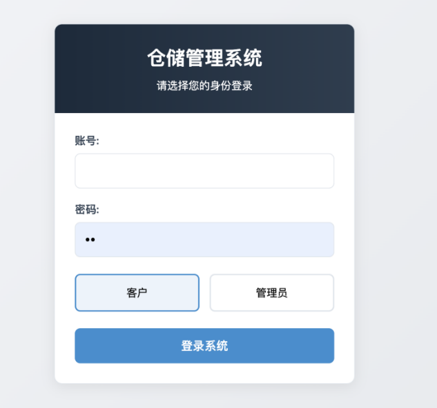
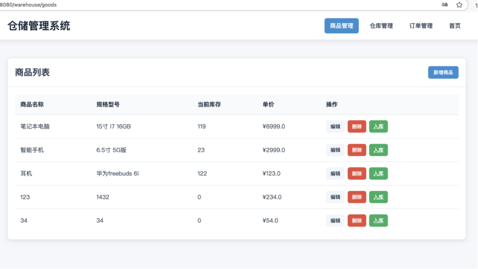
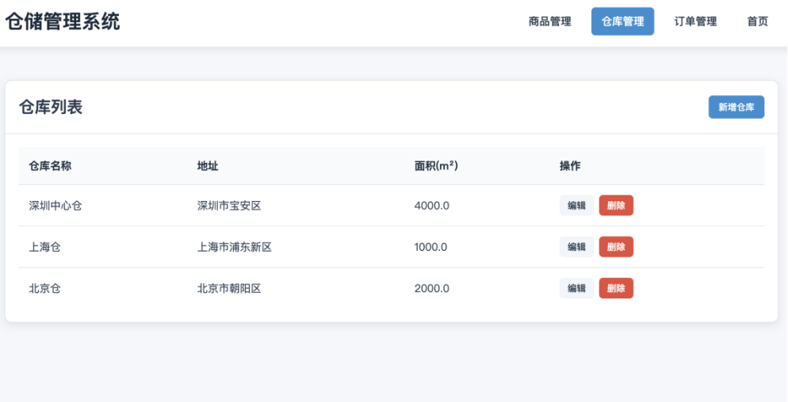
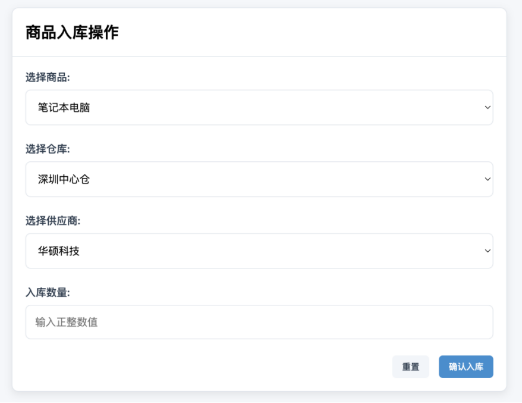
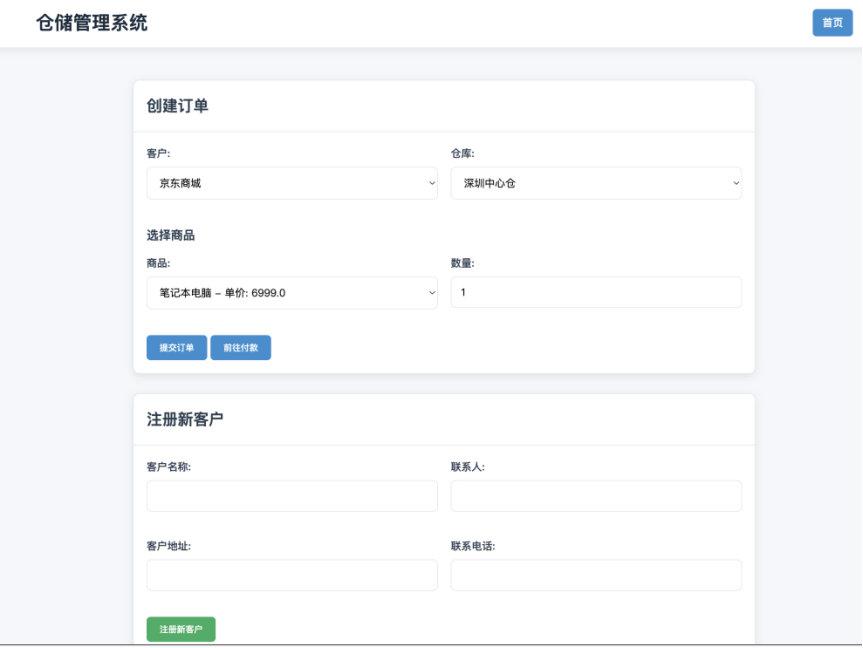
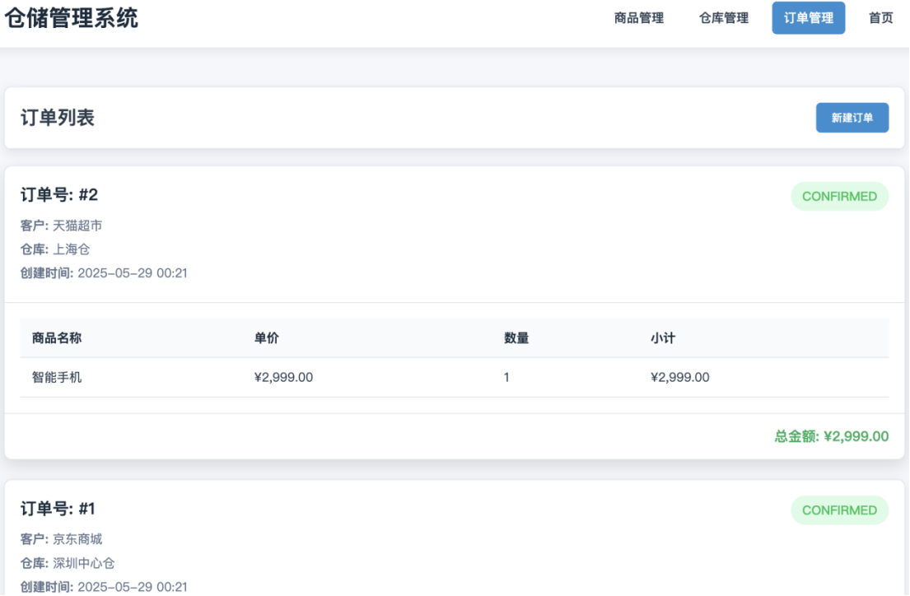
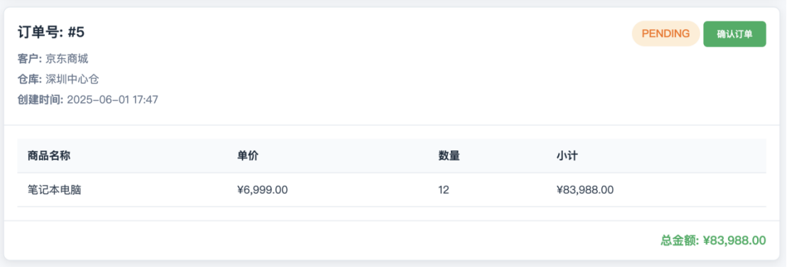

# 📦 WarehouseSystem — Java 仓储管理系统

[](https://java.com)
[](https://spring.io)
[](https://mysql.com)
[](https://maven.apache.org)
[](https://github.com/alibaba/druid)

基于 Java 17 + Spring MVC 5 + JDBC + Druid + MySQL + JSP 的传统 Servlet 仓库管理系统。  
**9 个 Controller + 7 个 DAO + 5 个 Model**，覆盖商品管理、订单管理、入库/出库、客户/供应商管理、多仓库管理、付款管理。

---

## 📸 完整运行截图（4+3 网格 · 统一缩放适配）

> 7 张截图大小有差异（最小登录 633×592，最大订单列表 1105×724），用 HTML `` 标签统一 `width="420"` 缩放 + 4+3 表格对齐。

<table>
  <tr>
    <td align="center" width="25%">
      <b>① 登录（客户/管理员）</b><br>
      <br>
      633×592
    </td>
    <td align="center" width="25%">
      <b>② 商品列表主页</b><br>
      <br>
      973×549
    </td>
    <td align="center" width="25%">
      <b>③ 仓库列表</b><br>
      <br>
      994×508
    </td>
    <td align="center" width="25%">
      <b>④ 商品入库操作</b><br>
      <br>
      878×677
    </td>
  </tr>
  <tr>
    <td align="center">
      <b>⑤ 创建订单 + 注册客户</b><br>
      <br>
      863×648
    </td>
    <td align="center">
      <b>⑥ 订单列表（CONFIRMED）</b><br>
      <br>
      1105×724
    </td>
    <td align="center">
      <b>⑦ 订单管理（PENDING 确认）</b><br>
      <br>
      1107×376
    </td>
    <td></td>
  </tr>
</table>

---

## 🏗️ 系统架构

```
前端 (JSP/HTML/CSS/JS)
  │
  ├── Controller 层（9 个）
  │   StartController │ GoodsController │ OrderController
  │   WarehouseController │ StockInController │ StockOutController
  │   CustomerController │ FukuanController │ XiadanController
  │
  ├── DAO 层（7 个）
  │   GoodsDAO │ OrderDAO │ WarehouseDAO │ StockDAO
  │   CustomerDAO │ SupplierDAO │ UserDAO
  │
  ├── Model 层（5 个）
  │   Goods │ Order │ Customer │ Supplier │ Warehouse
  │
  ├── Filter / Util
  │   EncodingFilter（统一 UTF-8 编码）│ ErrorHandler
  │
  └── Config
      DBConfig（Druid 数据源）
```

---

## ✨ 核心功能

| 模块 | Controller | DAO | 功能 |
|------|-----------|-----|------|
| **商品管理** | `GoodsController` | `GoodsDAO`（4747B） | 商品 CRUD + 搜索 + 库存状态 |
| **订单管理** | `OrderController`（4392B） | `OrderDAO`（8214B） | 下单/取消/查询/状态流转（PENDING/CONFIRMED） |
| **入库管理** | `StockInController`（2608B） | `StockDAO` | 入库记录 + 库存更新 |
| **出库管理** | `StockOutController`（2138B） | `StockDAO` | 出库记录 + 库存扣减 |
| **仓库管理** | `WarehouseController`（3496B） | `WarehouseDAO`（3448B） | 多仓库 CRUD + 容量管理 |
| **客户管理** | `CustomerController`（1588B） | `CustomerDAO`（1951B） | 客户信息 + 联系人 + 电话 |
| **供应商管理** | — | `SupplierDAO`（1045B） | 供应商信息 |
| **付款管理** | `FukuanController`（582B） | — | 付款记录 |
| **下单** | `XiadanController`（1273B） | `OrderDAO` | 快速下单 + 注册新客户 |
| **启动** | `StartController` | `UserDAO` | 启动页 + 登录验证 |

---

## 🗂️ 项目结构

```
WarehouseSystem/
├── src/main/
│   ├── java/com/warehouse/
│   │   ├── config/DBConfig.java                      # Druid 数据源配置
│   │   ├── controller/                                # 9 个 Controller
│   │   │   ├── StartController.java
│   │   │   ├── GoodsController.java
│   │   │   ├── OrderController.java
│   │   │   ├── WarehouseController.java
│   │   │   ├── StockInController.java
│   │   │   ├── StockOutController.java
│   │   │   ├── CustomerController.java
│   │   │   ├── FukuanController.java
│   │   │   └── XiadanController.java
│   │   ├── dao/                                       # 7 个 DAO
│   │   │   ├── GoodsDAO.java
│   │   │   ├── OrderDAO.java
│   │   │   ├── WarehouseDAO.java
│   │   │   ├── StockDAO.java
│   │   │   ├── CustomerDAO.java
│   │   │   ├── SupplierDAO.java
│   │   │   └── UserDAO.java
│   │   ├── filter/EncodingFilter.java                 # 字符编码过滤器
│   │   ├── model/                                     # 5 个 Model 实体
│   │   │   ├── Goods.java
│   │   │   ├── Order.java
│   │   │   ├── Customer.java
│   │   │   ├── Supplier.java
│   │   │   └── Warehouse.java
│   │   └── util/ErrorHandler.java                     # 错误处理工具
│   └── webapp/
│       ├── WEB-INF/
│       │   ├── views/                                 # 10 个 JSP 视图
│       │   │   ├── login.jsp
│       │   │   ├── goods-list.jsp
│       │   │   ├── order-list.jsp
│       │   │   ├── stock-in.jsp
│       │   │   ├── stock-out.jsp
│       │   │   ├── warehouse-list.jsp
│       │   │   ├── customer.jsp
│       │   │   ├── fukuan.jsp
│       │   │   ├── xiadan.jsp
│       │   │   ├── error.jsp
│       │   │   └── error-404.jsp
│       │   └── web.xml                                # Servlet 配置
│       ├── css/style.css                              # 全局样式
│       ├── js/main.js                                 # 通用脚本
│       ├── index.jsp                                  # 入口（重定向到 start）
│       └── skm.jpg                                    # 网站图标
├── target/classes/                                    # 编译产物
└── pom.xml                                            # Maven 配置
```

---

## 🚀 快速运行

```bash
# 1. 准备 MySQL 8（导入 DBConfig 指定的数据库）
# 2. 在 DBConfig.java 配置 Druid 数据源（URL / 用户名 / 密码）
# 3. 用 Eclipse / IntelliJ IDEA 导入 Maven 项目
# 4. 部署到 Tomcat 8.5+ 启动
# 5. 浏览器访问 http://localhost:8080/WarehouseSystem

# 或命令行：
mvn tomcat7:run    # 需要 tomcat7-maven-plugin
```

---

## 🧰 技术栈

- **Java 17**
- **Spring MVC 5**（传统 Servlet Stack）
- **JDBC**（原生 java.sql，DAO 模式）
- **Druid 1.2**（阿里开源连接池 + SQL 监控）
- **MySQL 8.0**（数据持久化）
- **JSP + JSTL**（视图层，Servlet 容器渲染）
- **Maven**（依赖管理）
- **Tomcat**（Servlet 容器）
- **HTML5 + CSS3 + Vanilla JS**（前端）

---

## 📌 面试要点（Java 后端方向）

| 主题 | 关键点 |
| --- | --- |
| **MVC 架构** | Controller → DAO → Model 三层分离；DAO 模式屏蔽 SQL 细节 |
| **Druid 连接池** | 阿里开源，`com.alibaba.druid.pool.DruidDataSource` 替代 DBCP/C3P0；自带 SQL 监控（`StatFilter`） |
| **JDBC vs JPA** | JDBC 灵活但繁琐；JPA/MyBatis 抽象度高；本项目 DAO 模式是 JDBC 经典实践 |
| **JSP 内置对象** | `request` / `response` / `session` / `application` / `out` / `config` / `pageContext` / `page` |
| **JSTL 标签库** | `<c:forEach>` / `<c:if>` / `<c:choose>` + EL 表达式 `${user.name}` 替代 JSP 脚本 |
| **Filter 过滤器** | `EncodingFilter` 统一 UTF-8 解决 POST 乱码；`Filter` 链在 Servlet 之前执行 |
| **URL 路由** | Spring `@RequestMapping` vs Servlet `<url-pattern>`；本项目用传统 Servlet Mapping |
| **订单状态流转** | PENDING → CONFIRMED；状态机模式避免非法状态；DAO 层做事务控制 |
| **多仓库库存** | 仓库表 + 库存表外键关联；同一商品在不同仓库有不同库存（`StockDAO` 按 warehouseId 查） |
| **DAO 单元测试** | 注入 mock DataSource 测 CRUD；@Transactional 回滚测试数据 |
