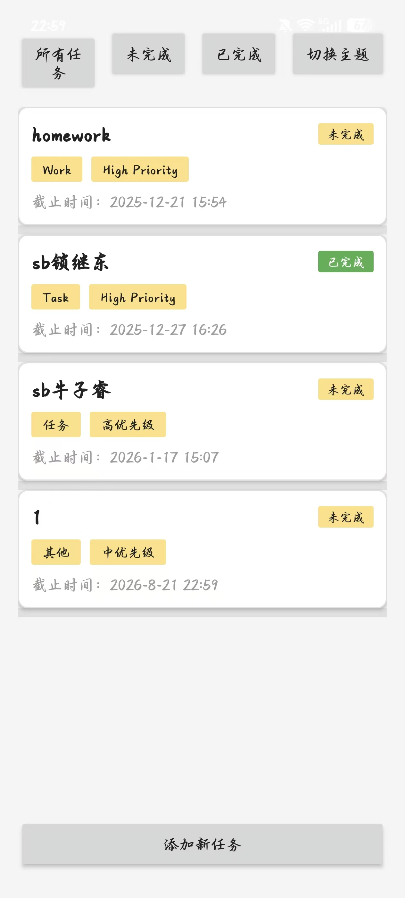
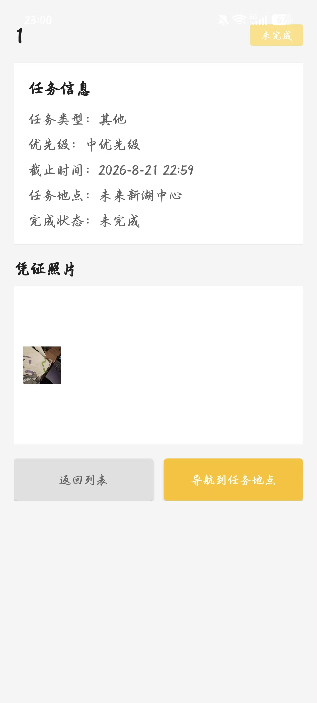
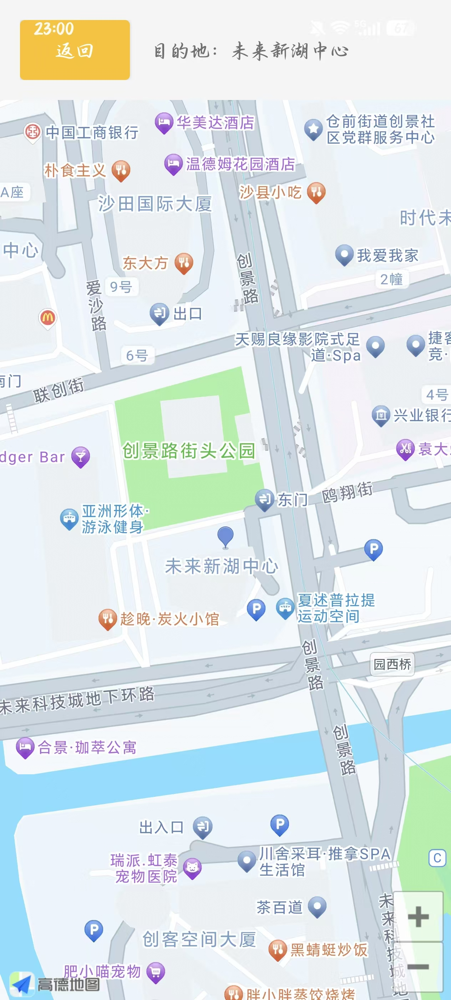
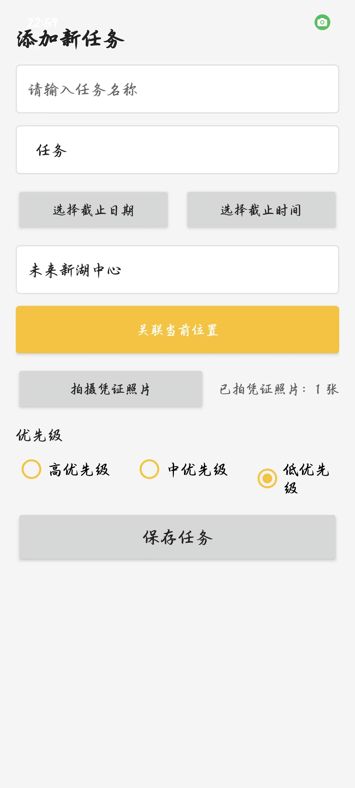

# 📱 CampusTaskManager — Android 校园任务管理 App

[](https://java.com)
[](https://gradle.org)
[](https://lbs.amap.com)
[](https://developer.android.com)

基于 **Android + Java + Gradle** 的校园任务管理 App。  
集成**高德地图 SDK v10.1.600**（路线规划 + 导航）、任务 CRUD 全流程（增删改查 + 分类 + 状态 + 优先级）、中英多语言、亮色/暗色双主题。  
**8 个 Java 源文件 + 6 个 XML 布局 + 5 层 mipmap 图标适配**，APK 已 release。

---

## 📸 应用截图（2×2 网格 · 统一缩放适配）

> 4 张原始截图均为 `1264×2800`（高德地图图最大 1.6MB，任务详情图最小 259KB，相差 6 倍），  
> 下面用 HTML `` 标签统一 `width="320"` 缩放，并用表格做 2×2 网格对齐，避免大小不一导致的视觉错乱。

<table>
  <tr>
    <td align="center" width="50%">
      <b>📋 任务列表主页</b><br>
      
    </td>
    <td align="center" width="50%">
      <b>📝 任务详情页</b><br>
      
    </td>
  </tr>
  <tr>
    <td align="center">
      <b>🗺️ 高德地图导航</b><br>
      
    </td>
    <td align="center">
      <b>➕ 添加新任务</b><br>
      
    </td>
  </tr>
</table>

---

## 🏗️ 核心架构

```
CampusTaskManager/
├── app/                                              # Android 应用模块
│   ├── libs/                                         # 第三方 jar
│   │   └── AMap3DMap_10.1.600_AMapSearch_9.7.4_AMapLocation_6.5.1_20251020.jar
│   ├── release/                                      # 已打包 APK
│   │   ├── app-release.apk
│   │   └── baselineProfiles/{0,1}/app-release.dm    # 启动基线 profile
│   ├── jniLibs/                                      # 高德地图 native 库
│   │   ├── arm64-v8a/libAMapSDK_MAP_v10_1_600.so
│   │   └── armeabi-v7a/libAMapSDK_MAP_v10_1_600.so
│   └── src/main/
│       ├── AndroidManifest.xml
│       ├── java/com/example/campustaskmanager/
│       │   ├── MyApplication.java                    # Application，AMap SDK 初始化
│       │   ├── SplashActivity.java                   # 闪屏页（权限检查 + 初始化）
│       │   ├── MainActivity.java              (7.7KB) 任务列表 + 筛选 + 状态管理
│       │   ├── TaskDetailActivity.java        (4.5KB) 任务完整信息 + 凭证照片
│       │   ├── TaskEditActivity.java         (11.7KB) 新建/编辑任务表单
│       │   ├── MapNavigationActivity.java     (2.6KB) 高德地图路线规划 + 导航
│       │   ├── Task.java                      (2.4KB) 任务实体 model
│       │   └── SharedPrefsHelper.java         (1.9KB) SharedPreferences 持久化
│       └── res/
│           ├── layout/                               # 6 个 XML 布局
│           ├── drawable/                             # 9 个 shape / selector
│           ├── mipmap-*/                             # 5 层图标密度适配
│           ├── values/                               # 中文 + 主题 + 颜色
│           ├── values-en/                            # 英文国际化
│           └── values-night/themes.xml               # 暗色主题
├── gradle/libs.versions.toml                         # Version catalog
├── build.gradle                                      # 项目级 Gradle
├── settings.gradle
└── gradle/wrapper/gradle-wrapper.properties          # Gradle 8.x
```

---

## ✨ 功能模块

| 模块 | Activity | 关键功能 |
| --- | --- | --- |
| **闪屏** | `SplashActivity` | App 启动 + 权限申请 + AMap 初始化 |
| **主页** | `MainActivity` | 任务列表（RecyclerView）+ 状态筛选（全部/未完成/已完成）+ 主题切换 |
| **任务详情** | `TaskDetailActivity` | 任务信息（类型/优先级/截止/地点/状态）+ 凭证照片 + 导航跳转 |
| **任务编辑** | `TaskEditActivity` | 新建/编辑表单：标题、描述、分类、截止日期、时间、位置获取、照片、3 档优先级 |
| **地图导航** | `MapNavigationActivity` | 高德地图 v10.1.600 路线规划 + 实时导航 |
| **持久化** | `SharedPrefsHelper` | SharedPreferences 序列化任务列表（增删改查） |
| **数据模型** | `Task` | id / title / description / category / status / priority / deadline / location / photoPath |
| **Application** | `MyApplication` | 全局 Context + 高德 SDK 鉴权初始化 |

---

## 🎨 UI 特性

- **彩色优先级标签**：`tag_bg_{green,yellow,red}.xml` 三个 shape 标识高/中/低 优先级与状态
- **卡片式列表**：`task_card_bg.xml` + `item_task.xml` 自定义 CardView
- **多语言**：`values/`（中文）+ `values-en/`（英文）双份 strings
- **双主题**：`values/themes.xml`（亮色）+ `values-night/themes.xml`（暗色），运行期可切换
- **5 层图标适配**：`mipmap-{m,h,xh,xxh,xxxh}dpi` + `mipmap-anydpi-v26` 自适应图标 XML
- **凭证照片**：`TaskEditActivity` 调用相机 → 存到本地 → 详情页展示
- **当前位置**：`TaskEditActivity` 集成 AMap Location SDK，自动填入任务地点

---

## 🗺️ 高德地图集成

- **3DMap SDK v10.1.600**：核心地图显示、marker、路线规划
- **Search SDK v9.7.4**：POI 搜索（"未来新湖中心"等）
- **Location SDK v6.5.1**：定位当前位置、自动填充任务地点
- **架构**：JAR 包（`libs/AMap3DMap_..._20251020.jar`）+ JNI 库（`jniLibs/{arm64-v8a, armeabi-v7a}/`）双层
- **应用初始化**：`MyApplication.onCreate()` 调 `AMapSDKManager.initialize(this)` 注入 API Key

---

## 🚀 构建运行

```bash
# 1. 克隆后用 Android Studio 打开（推荐 Hedgehog | Iguana | Jellyfish+）
# 2. 等待 Gradle 同步完成（libs.versions.toml 自动解析）
# 3. 连接 Android 设备（API 24+）后点 Run ▶️
# 4. 命令行构建 release：
./gradlew assembleRelease
# APK 输出：app/release/app-release.apk
```

> **必装依赖**：`com.android.application` Gradle Plugin + JDK 17 + Android SDK Platform 34

---

## 🧰 技术栈

- **Java 8**（sourceCompatibility/targetCompatibility）
- **Android SDK**（minSdk 24, targetSdk 34）
- **Gradle 8** + Version Catalog（`libs.versions.toml`）
- **高德地图 SDK v10.1.600**（3DMap / Search / Location 三件套）
- **AndroidX** AppCompat + Material + RecyclerView + CardView
- **SharedPreferences**（数据持久化）
- **多语言**：中文简体 + English
- **双主题**：Material Light + Dark（`values-night/`）

---

## 📌 面试要点（Android 方向）

| 主题 | 关键点 |
| --- | --- |
| **Activity 跳转** | `startActivity(Intent)` + `Bundle` 传参；`onActivityResult` / `ActivityResultLauncher` 回传 |
| **RecyclerView 适配** | `RecyclerView.Adapter` + `ViewHolder` + `notifyDataSetChanged` 局部刷新 |
| **本地持久化** | `SharedPreferences` (轻量 KV) vs Room/SQLite (复杂关系)；本项目选 SharedPreferences 适合小数据量 |
| **多语言** | `values/strings.xml` + `values-en/strings.xml` 双语资源 + 系统 Locale 切换自动适配 |
| **多主题** | `values/themes.xml` + `values-night/themes.xml`；运行时 `setTheme(R.style.X)` 即时切换 |
| **第三方 SDK 集成** | AMap 三件套：JAR + JNI 双层分发，Application 统一初始化，权限申请（定位/存储/相机） |
| **5 层 mipmap** | mdpi / hdpi / xhdpi / xxhdpi / xxxhdpi 对应不同 DPI 设备；`mipmap-anydpi-v26` 适配图标 XML |
| **Gradle 8 + Version Catalog** | `libs.versions.toml` 集中管理依赖版本号，避免重复 |
| **APK 体积优化** | `baselineProfiles/{0,1}/` 启动基线（Android 13+ Baseline Profile 提升冷启动） |
| **Intent 传值** | 任务 ID 通过 `Intent.putExtra` 传 `TaskDetailActivity` / `TaskEditActivity` |

---

## 🪪 许可证

仅用于学习与个人作品展示，商用请自行替换高德地图 API Key。
