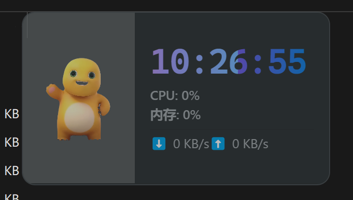
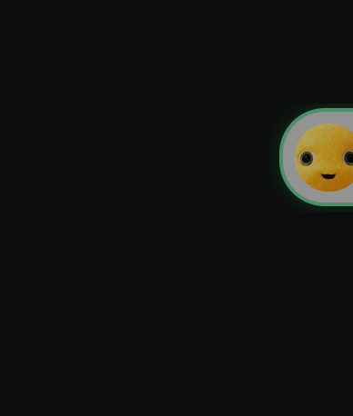
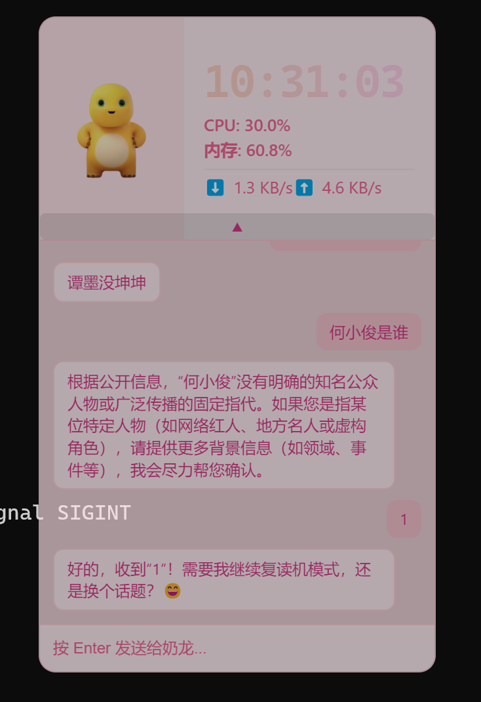
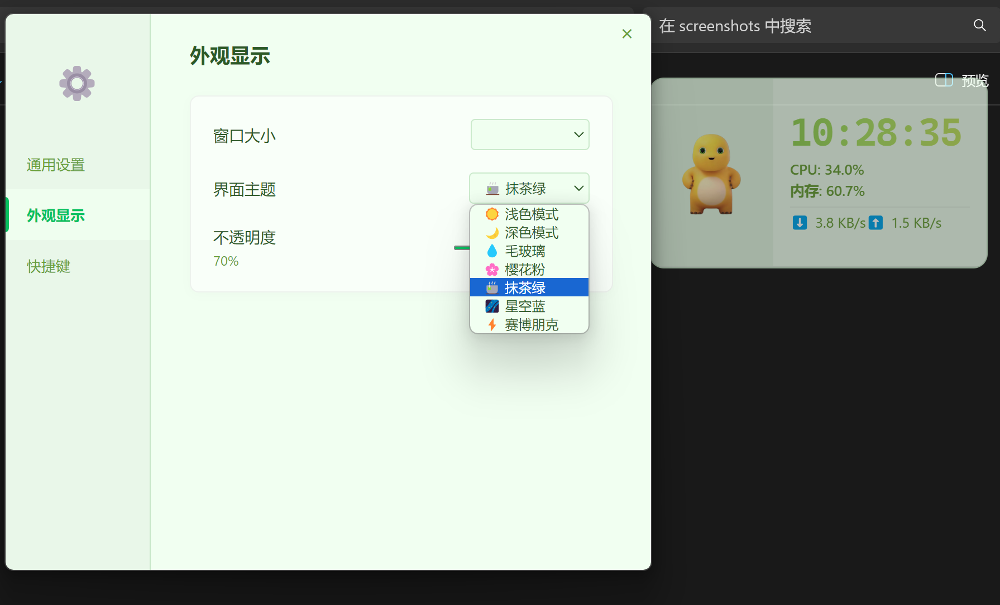

# 🖥️ Nailong Helper — Electron 桌面奶龙助手

基于 **Electron 30** 的桌面浮动助手，透明无边框 + 玻璃拟物 UI + 实时系统监控 + DeepSeek 聊天 + 边缘吸附。  
代码全在 `main.js`（370 行主进程）+ `renderer.js`（219 行渲染进程）+ `preload.js`（IPC 桥），无打包构建过程——`npm start` 直接出窗口。

---

## 📸 真实运行截图（2×2 网格 · 统一缩放适配）

> 4 张截图大小差异巨大：
> - 主界面 694×394（横屏小窗）  
> - 悬浮球 388×458（吸附态小窗）  
> - 聊天界面 734×1070（竖屏）  
> - 设置 1791×1084（横屏大窗，最大）  
> 
> 用 HTML `` 标签统一 `width="480"` 缩放 + 2×2 表格对齐，避免大小不一导致的视觉错乱（只缩宽度不缩高度，自然保留各图比例）。

<table>
  <tr>
    <td align="center" width="50%">
      <b>主界面（深色主题）</b><br>
      <br>
      透明无边框 + 时钟 + 实时 CPU/内存/网速
    </td>
    <td align="center" width="50%">
      <b>悬浮球（边缘吸附态）</b><br>
      <br>
      拖至左/右边缘 20px 触发，缩为 60×60 圆球
    </td>
  </tr>
  <tr>
    <td align="center">
      <b>聊天界面（樱花粉主题）</b><br>
      <br>
      DeepSeek 真实对话 + 主题切换联动
    </td>
    <td align="center">
      <b>偏好设置（抹茶绿 + 主题下拉）</b><br>
      <br>
      7 套主题：浅色 / 深色 / 毛玻璃 / 樱花粉 / 抹茶绿 / 星空蓝 / 赛博朋克
    </td>
  </tr>
</table>

---

## ✨ 核心特性

### 1. 边缘吸附引擎（main.js L74-156）
完全重构的防抖拖拽边缘吸附：
- `dock()`：距离边缘 < **20px** 触发，窗口缩为 60×60 圆球，`setAlwaysOnTop(true)`
- `restore()`：拖拽拉出 > **45px** 恢复原尺寸，自动避让边缘（15px buffer）
- **150ms 防抖定时器**：用户拖拽未松手时不动 bounds，松手后自动弹回
- `isResizing` 标志 + 200ms / 600ms 冷却防止误触

### 2. 实时系统监控（main.js L182-208）
`systeminformation` 每秒采集：
- `si.currentLoad()` → CPU 整数百分比
- `si.mem()` → 内存占用百分比（`(active/total)*100`）
- `si.networkStats()` → 全网卡 `rx_sec` / `tx_sec` 累加 → KB/s

通过 IPC `system-info` 事件推到渲染进程（`onUpdateSystemInfo` 注册回调）。

### 3. DeepSeek 聊天（main.js L254-332）
`electron-store` + `name: 'chat-history'` 独立命名空间持久化：
- **System Prompt 限定角色**为"可爱幽默的奶龙"，回复控制在 100 字内
- 每次请求拼接 `[{ system }, ...history, { user }]` 走 `api.deepseek.com/chat/completions`，`temperature: 0.7`
- `clear-chat-history` 支持 `all / 7days / 30days / 1year / 1day / 1hour` 六档过滤（前端下拉）

### 4. 语音引擎按需启停（main.js L24-51, 240-250）
`spawn('cmd.exe', ['/c', start_voice.bat])` 启动 Python 语音识别/合成子进程：
- 展开聊天面板 → 启动引擎（防重入）
- 收缩面板 → 14 秒延迟 → `taskkill /pid ${voiceProcess.pid} /T /F` 清理子进程树
- `app.on('will-quit')` 兜底二次清理

### 5. 弹珠屏保（renderer.js L127-166）
`NailongBall` 类，WebM 视频节点 + 物理模拟：
- 30-50px 随机尺寸，`(Math.random() - 0.5) * 14` 随机初速度
- 撞墙反弹 + `vx *= 1.05` 加速扩散
- `requestAnimationFrame` 驱动，**离屏（>100px）自动销毁**防止泄漏

### 6. 弹幕系统（renderer.js L100-111）
9 条预设弹幕（"我是奶龙""涂维兮yyds""mimimimi" 等），鼠标进入头像 / 闲置 20s 触发，2.5s 后自动移除。

### 7. 7 套主题（settings.html L264-272）
`light / dark / glass / sakura / matcha / ocean / cyber`，通过 `data-theme` 属性切换 CSS 变量——`--bg-color / --text-primary / --time-gradient` 全部走 var()。

### 8. 全局快捷键
`Ctrl+Alt+Q`（可自定义）唤起/隐藏助手，`globalShortcut.register` 注册，`unregisterAll` 防冲突。

---

## 🛡️ 安全实践（已修复）

- ❌ ~~`main.js` 中硬编码 DeepSeek API Key `sk-1e40463b...`~~
- ✅ **改为** `process.env.DEEPSEEK_API_KEY` 注入，启动前 `export DEEPSEEK_API_KEY=sk-xxxx` 即可

---

## 🗂️ 项目结构

```
electron-floating-helper/
├── main.js                   # 370 行：主进程（窗口/吸附/监控/聊天/语音/快捷键/托盘）
├── renderer.js               # 219 行：渲染进程（动画/弹幕/弹珠/聊天 UI）
├── preload.js                # 预加载：contextBridge.exposeInMainWorld('electronAPI', ...)
├── index.html                # 主浮动窗口（吉祥物 + 监控 + 聊天面板 + 弹珠容器）
├── settings.html             # 设置页：130px 侧栏 + 3 个 tab（通用/外观/快捷键）
├── style.css                 # 全局样式 + 7 套 data-theme 变量 + 玻璃拟物
├── config.json               # 本地默认配置（不含 API Key）
├── package.json              # electron 30 + electron-store 8 + systeminformation 5
└── assets/
    ├── nailong.png           # 静态吉祥物
    ├── nailongbg.ico         # 吸附态圆球图标
    ├── nailonghuishou.webm   # 鼠标 hover 挥手动画
    ├── nailongdaxiao.webm    # 点击大笑动画 + 弹珠屏保
    └── voice_models/         # 语音引擎模型（打包时通过 extraResources 携带）
```

---

## 🚀 快速开始

```bash
# 1. 安装依赖
npm install

# 2. 设置环境变量（避免 Key 写进代码）
export DEEPSEEK_API_KEY=sk-xxxxxxxxxxxxxxxxxxxxxxxx

# 3. 启动（开发模式）
npm start

# 4. 打包（Windows NSIS 安装包到 dist/）
npm run build
```

> **首次启动**会请求 `dialog.showOpenDialog` 选语音引擎路径，**未选择**也能正常用聊天和监控功能。

---

## 🧰 技术栈

- **Electron 30** · electron-store 8.2 · systeminformation 5.30
- **原生 JS / CSS**（无构建工具，无 React/Vue 依赖）
- **DeepSeek Chat API**（OpenAI 兼容协议）
- **electron-builder 26**（NSIS 安装包，含 `assets/voice_models` 与 `voice_engine/` 作为 `extraResources`）

---

## 📌 面试要点（桌面端 / 前端方向）

| 主题 | 关键点 |
| --- | --- |
| **进程模型** | 主进程 / 渲染进程 / preload 三层；`contextIsolation: true` + `nodeIntegration: false` 必开 |
| **IPC 通信** | `ipcMain.handle` (Promise 风格) vs `ipcMain.on` (单向)，`ipcRenderer.invoke` 双向 |
| **透明窗口** | `transparent: true` + `frame: false` + `skipTaskbar: true`，CSS 配合 `backdrop-filter: blur` |
| **边缘吸附** | 监听 `move` 事件 + `screen.getDisplayNearestPoint` 拿 workArea + 防抖定时器抢鼠标 |
| **系统监控** | `systeminformation` Promise 链 + 1Hz 轮询 + IPC 推送，错误兜底（`si.networkStats` 经常空） |
| **配置持久化** | `electron-store` 三层合并：DEFAULTS / config.json / store.get('config') |
| **主题系统** | 7 套主题 = 7 套 CSS 变量，`<body data-theme="x">` 切换，零 JS 重渲染 |
| **动画** | 弹珠物理：`requestAnimationFrame` + 速度衰减；闲置 20s 弹幕触发 |
| **构建发布** | electron-builder `extraResources` 携带运行时需要的 voice_engine / voice_models；NSIS 一键安装 |
