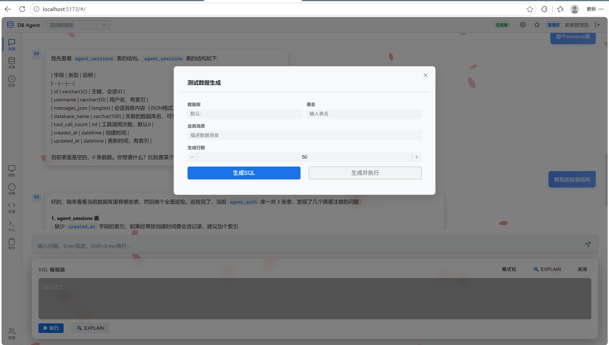
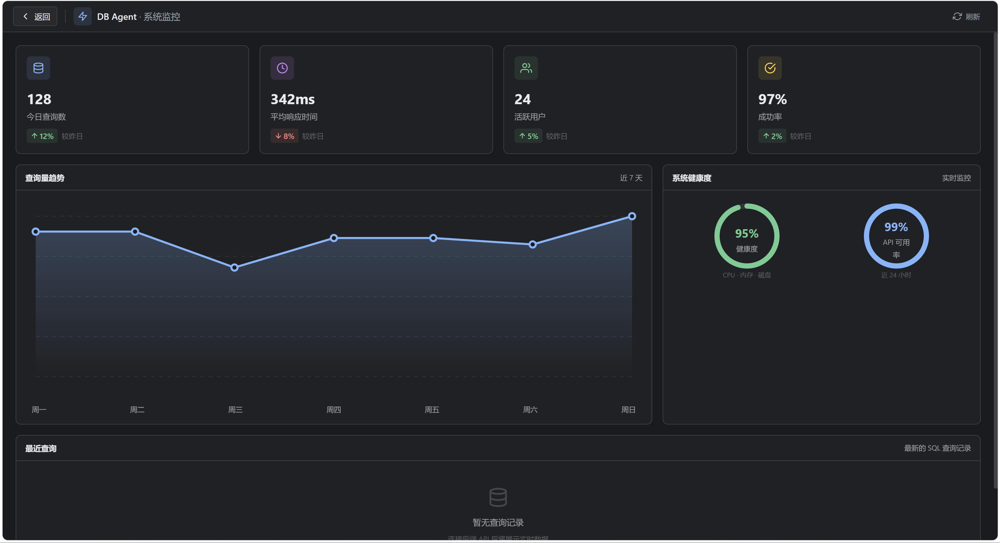
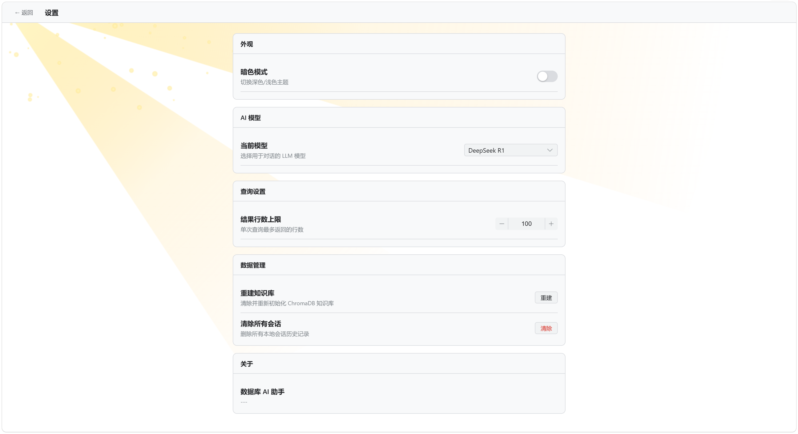

# 🗄️ DB Agent — 基于 LLM 的数据库自治代理系统

[](https://python.org)
[](https://fastapi.tiangolo.com)
[](https://vuejs.org)
[](https://react.dev)
[](https://deepseek.com)
[](https://trychroma.com)
[](https://mysql.com)

1,460 行纯自研代码 · 12 个算法模块 · P0-P2 三级全落地 · 零框架黑盒

---

## 技术架构

```
前端: Vue 3 (Composition API + Element Plus) + React 18 (系统监控仪表盘)
后端: FastAPI (SSE 流式 + 30 个 REST 端点)
Agent 层: Orchestrator → TokenBudget → AdaptiveLoop → Tools
安全: 三层 SQL 沙箱 + RBAC + JWT + 审计日志 + 连接池
记忆: Working Memory → PER 经验回放 → ChromaDB RAG
数据库: MySQL 8.0 + agent_auth 认证库
```

---

## 核心算法

### Agent Loop

采用**混合终止策略**：五维规则层 + LLM 语义层联合判断。

- Token Budget 经济模型（正常 → 预警 → 临界 → 超限，分步降级）
- 五维自适应终止（指纹冗余检测 / 连续失败 / 信息增益停滞 / 数据充分 / 轮次上限）
- LLM Self-Evaluator 语义级自评：输出 `{can_answer, confidence, missing}` 决策 JSON
- 规则兜底（Token 耗尽、最大轮次、重复错误）+ JSON 解析容错 + 关键词回退

**失败自愈**：5 策略自愈矩阵，包括 Levenshtein 编辑距离 + 元数据约束双重验证的智能列名修正。

### Multi-Agent

基于 DAG 的完整任务分解→调度→聚合闭环。

- Orchestrator 将用户问题分解为子任务 DAG
- Kahn 拓扑排序分层，同层 asyncio.gather 并行执行
- SharedWorkingMemory Sub-Agent 间共享上下文
- AgentMailbox Actor Model 异步消息传递

### Agent Memory

三层记忆架构：

1. **Working Memory**（`AgentWorkingState`）：plan / explored_tables / findings / last_query_sql
2. **Episodic Memory**（`PrioritizedEpisodicMemory`）：基于 TD-error 的优先经验回放，heapq 采样，独立 System Prompt 注入
3. **RAG 知识库**（ChromaDB + Sentence-Transformers）：13 条预置知识 + 自动沉淀 + 语义检索

### CoT 推理可视化

DeepSeek R1 的 `reasoning_content` 思维链通过 SSE `type:reasoning` 事件推送前端，支持展开 / 收起推理链，展示工具调用步骤实时卡片。

---

## 安全体系

### 三层 SQL 沙箱

```
请求 → JWT 认证 → RBAC 角色检查
  Layer 1: 类型检查（仅 SELECT / EXPLAIN / DESCRIBE / SHOW）
  Layer 2: 关键字黑名单（DROP / ALTER / INSERT / CREATE / TRUNCATE ...）
  Layer 3: 注入检测（堆叠查询 / UNION / 盲注 / 文件写入 / 编码绕过，11 条规则）
  只读账号 + 自动 LIMIT + 查询超时
```

| 组件 | 功能 |
|------|------|
| JWT + BCrypt | HS256 签名，8h 过期 |
| RBAC | admin / reader 双角色依赖注入 |
| 审计日志 | 全操作追溯 + CSV 导出 |
| Guardrails | 防幻觉：回答表名 ∈ explored_tables |
| Human-in-the-loop | DROP / TRUNCATE / ALTER 审批队列 |
| 连接池 | DBUtils PooledDB（8 连接 + 自动 ping） |
| 自动备份 | DROP / ALTER 前 mysqldump + 一键恢复 |

---

## 功能

- 自然语言→SQL：自动查元数据生成查询
- 表结构巡检：缺失主键 / 无索引大表 / 命名规范
- SQL 慢查询诊断：EXPLAIN + 智能优化建议
- 测试数据生成：Faker 推断列类型，生成仿真 INSERT
- SQL 编辑器：格式化 + 执行 + EXPLAIN
- 用户管理：创建 / 禁用 / 删改用户和角色

---

## 📸 完整运行截图（4+4 网格 · 统一缩放适配）

> 8 张截图大小不一致（5 张 3072×~1700 大图 + 2 张 1280×800 较小 + 1 张 3070×1746），用 HTML `` 标签统一 `width="420"` 缩放 + 4+4 表格对齐。

<table>
  <tr>
    <td align="center" width="25%">
      <b>① 登录</b><br>
      <br>
      1280×800
    </td>
    <td align="center" width="25%">
      <b>② 对话主界面</b><br>
      <br>
      1280×800
    </td>
    <td align="center" width="25%">
      <b>③ 工具调用卡片</b><br>
      <br>
      3070×1746
    </td>
    <td align="center" width="25%">
      <b>④ CoT 推理链</b><br>
      <br>
      3072×1742
    </td>
  </tr>
  <tr>
    <td align="center">
      <b>⑤ 管理后台</b><br>
      <br>
      3072×1670
    </td>
    <td align="center">
      <b>⑥ 表巡检</b><br>
      <br>
      3068×1676
    </td>
    <td align="center">
      <b>⑦ ⚛️ React 仪表盘</b><br>
      <br>
      3071×1668
    </td>
    <td align="center">
      <b>⑧ 设置页</b><br>
      <br>
      3072×1672
    </td>
  </tr>
</table>

---

## 🎨 前端视觉设计

**双主题 + 主题联动特效**。所有视觉元素（背景、卡片、按钮、动效）均纯手写，未使用任何 UI 主题库或动画库。

### 双主题切换

`Settings.vue` 开关控制 `html.light-theme` class，状态持久化到 `localStorage`。切换时 `style.css` 50+ CSS 变量统一切换，零硬编码：

| 维度 | 暗色（默认） | 浅色 |
|------|------------|------|
| 主背景 | `#1a1b1e` 深空黑 | `#ffffff` 纯白 |
| 强调色 | `#8ab4f8` 柔和蓝 | `#1a73e8` Google 蓝 |
| 次文字 | `#9aa0a6` | `#5f6368` |
| 设计语言 | Professional Dark（IDE 风格） | Google Material Light |

### 暗色主题 · 流星划过夜空

`Login.vue` Canvas 2D 星空系统：200 颗独立呼吸的星星 + 4 颗斜向下飞行的流星（带渐变拖尾）+ 2 个 `blur(120px)` 大模糊光斑 14 秒慢速漂浮 + `radial-gradient` 深空径向渐变背景 + `cardIn 0.7s` 登录卡入场 + `logoGlow 3.5s` Logo 呼吸光晕。

### 浅色主题 · 雨滴 / 樱花 / 阳光浮尘 三种特效轮换

`Settings.vue` 和 `Chat.vue` Canvas 2D 白天背景系统：每 15-30 秒自动切换（`effIdx` 轮询），`effTT` 控制淡入淡出：

- **🌧️ 雨滴**：120 颗淡蓝半透明斜线，自由下落模拟风雨
- **🌸 樱花**：40 片贝塞尔曲线手绘 4 瓣花瓣，色相 340-380（红粉到品红），横向 sin 摆动 + 持续旋转
- **☀️ 阳光浮尘**：70 颗淡黄圆形，从左上方 30% 区域缓慢上升，营造"阳光透过窗户"感

### 设计理念：简约 · 美观 · 整齐

| 原则 | 实现 |
|------|------|
| **信息密度** | 13px 基准字号 + `line-height: 1.5`，所有页面一致 |
| **圆角分级** | 4px 按钮 / 6px 卡片 / 8px 模态，统一 3 档 |
| **过渡时长** | 0.15s hover / 0.25s focus / 0.7s 入场 |
| **字体分级** | Inter（界面） · JetBrains Mono（代码） · PingFang SC（中文） |
| **Token 化** | 50+ CSS 变量，主题切换只改 30 行变量定义 |
| **装饰不干扰** | canvas 全屏 `z-index: 0` + `pointer-events: none`，主内容独立层 |

---

## ⚛️ 前端架构（Vue 3 + React 18 双框架）

项目前端是 **Vue 3 + React 18 双框架共存** 的"微前端"模式：Vue 3 负责业务主页面，React 18 负责系统监控仪表盘。两者通过 Vite 多入口构建在同一个仓库内并行开发，**共享设计 Token + API 客户端 + LocalStorage Token**。

### 双框架

| 维度 | Vue 3 | React 18 |
|------|-------|----------|
| **职责** | 业务主页面（CRUD / 表单 / 长列表 / SSE 流式） | 系统监控仪表盘（实时图表 / 仪表盘） |
| **优势** | Element Plus 生态成熟、表单双向绑定、SFC 简洁 | SVG 图表组件灵活、Hooks 抽象、纯函数组件 |
| **学习价值** | 国内主流 | 国际化主流，体现"会用两种框架"的工程能力 |


### 🎨 Vue 3 业务主页面（`frontend/src/pages/`）

8 个 `.vue` 单文件组件，覆盖全业务流程：

| 页面 | 职责 |
|------|------|
| `Login.vue` | 用户登录 + 角色识别（admin / reader） |
| `Chat.vue` | 自然语言对话主界面（侧边栏 + 消息流 + 输入框 + CoT 折叠） |
| `Settings.vue` | 全局设置（LLM 模型 / 温度 / TopK / 数据库连接测试） |
| `Favorites.vue` | 收藏的查询语句（星标 + 一键重发） |
| `AuditLog.vue` | 审计日志列表（时间 / 用户 / SQL / 状态 / 耗时） |
| `AdminUsers.vue` | 用户管理（创建 / 禁用 / 改角色） |
| `AdminBackups.vue` | DROP/ALTER 自动备份列表（恢复入口） |
| `AdminKnowledge.vue` | ChromaDB 知识库 CRUD（13 条预置 + 自定义条目） |

**关键设计**：
- **Composition API** + `<script setup>` 语法（Vue 3.2+ 主流写法）
- **Element Plus** UI 组件库（`el-form` / `el-table` / `el-dialog` / `el-message`）
- **Pinia 状态管理**（`src/store/auth.js` 保存 JWT + 用户信息）
- **SSE 流式接收**（`EventSource` 接收 FastAPI 的 `text/event-stream`）
- **路由** Vue Router 4（`createWebHashHistory` 走 hash 模式，免后端配合）

---

### ⚛️ React 18 监控仪表盘（`frontend/src/react-dashboard/`）

单页面应用（ 3 个文件：`App.jsx` 522 行 + `main.jsx` + `App.css`），独立 HTML 入口 `/dashboard.html`。
完全匹配 Vue 项目 `frontend/src/style.css` 的 CSS 变量，**用户从 Vue 路由跳到 React 仪表盘，视觉无切换感**。

#### 图表（无图表库依赖）

| 组件 | 实现 | 关键技术 |
|------|------|----------|
| `LineChart` | 折线图 + 渐变面积 | SVG `<path>` + `<linearGradient>` + 数据点 `<circle>` |
| `GaugeRing` | 环形仪表盘 | SVG `<circle>` + `stroke-dasharray` + `stroke-dashoffset` + CSS `transition: 1.2s ease` |
| `StatCard` | 统计卡片 | inline SVG 图标 + 趋势箭头 + 渐变背景 `rgba(138,180,248,0.12)` |
| `TopBar` | 顶部导航 | flex 布局 + 返回链接 + 刷新按钮 |
| 数据表 | 最近查询 | 纯 HTML `<table>` + `status-badge` 状态色 |

---

## 项目结构

```
backend/
  agent/                        Agent 算法模块（12 个）
    loop_engine.py              核心算法：TokenBudget / AdaptiveLoop / SelfHealing
    scheduler.py                主循环：SSE 流式对话 / 模块集成
    session_manager.py          会话管理 / 智能裁剪 / TTL
    self_evaluator.py           LLM 自评终止判断
    episodic_memory.py          PER 优先经验回放
    tool_dependency.py          Kahn 拓扑排序 / 并行批次
    orchestrator.py             Multi-Agent 编排 / DAG / SharedMemory
    agent_registry.py           Agent 注册 + 意图路由
    guardrails.py               防幻觉 / 审批队列
    cost_tracker.py             Token 成本追踪
    telemetry.py                OpenTelemetry Tracing
  api/routes.py                 30 个 REST 端点
  auth/                         JWT + RBAC + 用户管理
  security/                     安全沙箱 / 连接池 / 备份
  tools/                        8 个独立工具
  eval/                         静态 + 端到端评估
  rag/                          ChromaDB 知识库
  main.py                       应用入口
  config.py                     配置
  requirements.txt              依赖
frontend/
  src/pages/                    Vue 3 页面（Login / Chat / Settings 等 8 个）
  src/react-dashboard/          React 18 系统监控仪表盘（App.jsx 522 行 + main.jsx + App.css）
  src/store/auth.js             认证状态管理（Pinia）
  src/config.js                 配置
  index.html / dashboard.html   多入口构建（Vue + React 共存）
  vite.config.js                构建配置（vue + react 插件）
```

---

## 快速开始

```bash
# 后端
cd backend
pip install -r requirements.txt
cp .env.example .env    # 填入 DeepSeek API Key + MySQL 信息
python -m uvicorn main:app --host 0.0.0.0 --port 8000 --reload

# 前端
cd frontend
npm install
npm run dev    # http://localhost:5173
```

默认账户：admin / admin123 | 需要 MySQL 8.0+ 和 DeepSeek API Key

---

## 评估

- 20 个测试用例静态评估
- `evaluate_e2e()` 端到端真实 Agent 运行
- Token 成本实时追踪

---

## 🧰 技术栈

**后端**：Python 3.11+ · FastAPI 0.115 · DeepSeek V3 / R1 · ChromaDB · Sentence-Transformers · MySQL 8.0 · OpenAI SDK · JWT · BCrypt  
**前端**：Vue 3 (Composition API) · **React 18** (系统监控仪表盘) · Element Plus · Vite  
**安全**：三层 SQL 沙箱 · RBAC · 审计日志 · 连接池 · 自动备份
