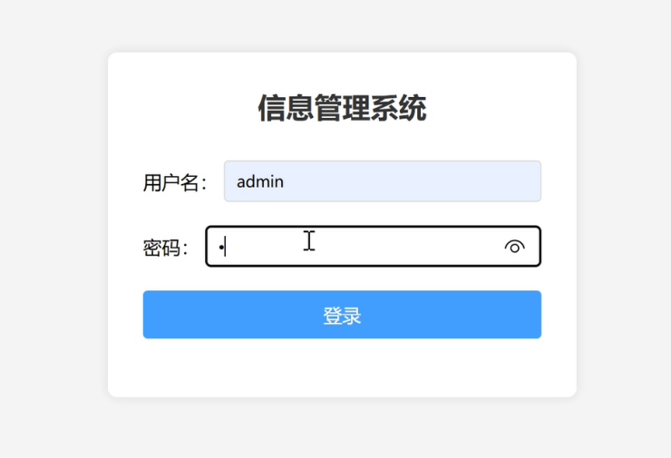
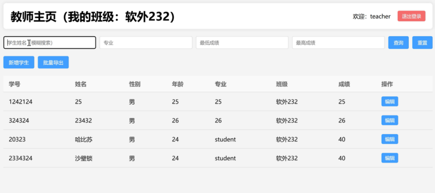
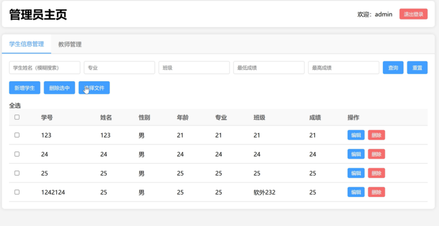
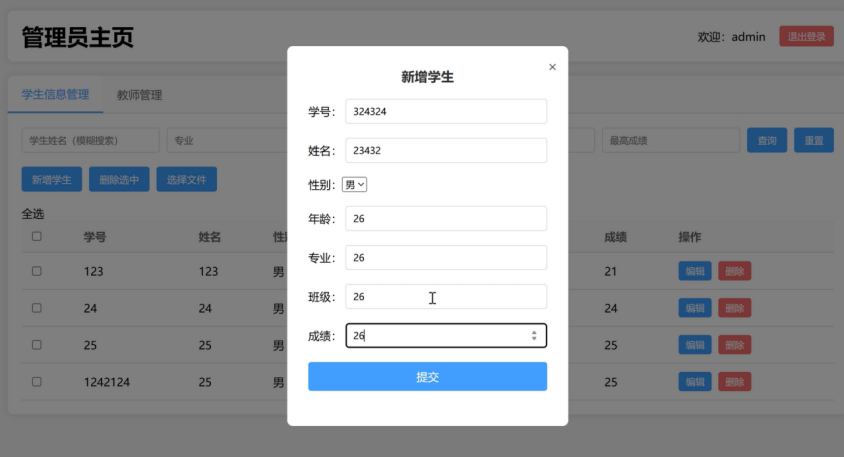

# 🎓 StudentManageSystem — 学生信息管理系统（Spring Boot 骨架）

[](https://spring.io)
[](https://openjdk.org)
[](https://maven.apache.org)
[](https://mysql.com)
[](https://poi.apache.org)

基于 **Spring Boot 3.2 + JDK 21 + Spring JDBC + MySQL + Apache POI** 的学生信息管理系统后端骨架。  
当前仓库为**后端骨架阶段**：含登录拦截器（双权限校验）+ CORS 跨域配置 + Excel 导入导出依赖。  
**完整运行效果**见下方 4 张截图（前端含登录、教师主页、管理员主页 Tab、新增学生弹窗）。

---

## 📸 完整版运行截图（2×2 网格 · 统一缩放适配）

> 4 张截图大小相近（740-897 × 399-505），用 HTML `` 标签统一 `width="540"` 缩放 + 2×2 表格对齐。

<table>
  <tr>
    <td align="center" width="50%">
      <b>登录页（信息管理系统）</b><br>
      <br>
      用户名 / 密码 + 登录按钮
    </td>
    <td align="center" width="50%">
      <b>教师主页（软外 232 班级）</b><br>
      <br>
      学生列表 + 筛选 + 新增 + 批量导出
    </td>
  </tr>
  <tr>
    <td align="center">
      <b>管理员主页（Tab 切换）</b><br>
      <br>
      学生信息管理 / 教师管理 + 表格 + 多选 + 增删改 + 上传文件
    </td>
    <td align="center">
      <b>管理员 · 新增学生弹窗</b><br>
      <br>
      学号 / 姓名 / 性别 / 年龄 / 专业 / 班级 / 成绩
    </td>
  </tr>
</table>

---

## ⚠️ 当前仓库状态说明

**当前 git 仓库为后端骨架阶段**（已上传的代码）：

```
student-manage-system/
├── pom.xml                                              # Spring Boot 3.2 + JDK 21 + 依赖
└── src/main/java/com/example/studentmanage/
    ├── StudentManageApplication.java                    # 启动入口
    └── config/
        ├── WebConfig.java                               # 拦截器注册 + CORS 跨域
        └── LoginInterceptor.java                        # 双权限校验拦截器
```

> 📌 截图展示的是**完整版的运行效果**（含前端 + 全部 Controller/Service/Repository）。  
> 该完整版以本仓库的 Spring Boot 骨架为底座演进，截图保留作为目标 UI 展示。

---

## 🧩 已实现代码详解

### 1. 启动入口（`StudentManageApplication.java`）
- 标准 `@SpringBootApplication` 启动
- 包路径：`com.example.studentmanage`
- 默认扫描当前包下所有 `@Component` / `@Configuration` / `@RestController`

### 2. Web 配置（`WebConfig.java`）
```java
@Configuration
public class WebConfig implements WebMvcConfigurer {
    // 注册登录拦截器：拦截所有路径，排除登录页、登录/登出接口、静态资源
    @Override
    public void addInterceptors(InterceptorRegistry registry) {
        registry.addInterceptor(new LoginInterceptor())
                .addPathPatterns("/**")
                .excludePathPatterns("/pages/login.html", "/login", "/logout", "/css/**", "/js/**");
    }

    // CORS 跨域：放行所有 localhost:*（开发期 Vue 跨域调用）
    @Override
    public void addCorsMappings(CorsRegistry registry) {
        registry.addMapping("/**")
                .allowedOriginPatterns("http://localhost:*")
                .allowedMethods("*")
                .allowedHeaders("*")
                .allowCredentials(true)
                .maxAge(3600);
    }
}
```

### 3. 登录拦截器（`LoginInterceptor.java`）
**双权限校验**：
- **登录态校验**：`session.getAttribute("loginUser")` 是否存在，否则重定向到 `/pages/login.html`
- **管理员权限校验**：URI 含 `/admin/` 时，要求 `loginUser.getRole() == "admin"`，否则跳 403
- **异步请求识别**：`X-Requested-With == XMLHttpRequest` 时返回 401 而非跳转（前端可识别）
- **调试日志**：`System.out.println` 打印 URI、JSESSIONID、loginUser（开发期辅助）

> 引用了 `com.example.studentmanage.entity.User` 实体（username / role 字段），该实体在完整版中提供。

---

## 📦 依赖（pom.xml）

| 依赖 | 版本 | 用途 |
|------|------|------|
| `spring-boot-starter-web` | 3.2.0 | Web 容器 + REST 接口 |
| `spring-boot-starter-jdbc` | 3.2.0 | JdbcTemplate 数据库访问 |
| `mysql-connector-j` | 8.x | MySQL 驱动（runtime） |
| `javax.servlet-api` | 4.0.1 | HttpSession / Request API（provided） |
| `poi` + `poi-ooxml` | 5.2.5 | Excel 导入导出（.xls + .xlsx） |
| `lombok` | 由 Spring Boot 管理 | 简化实体 getter/setter |

---

## 🚀 快速运行（开发期）

```bash
# 1. 安装 JDK 21
java -version   # 期望 21.x

# 2. 在 application.yml 配置 MySQL 数据源（仓库未提交，含敏感信息）
#    spring.datasource.url=jdbc:mysql://localhost:3306/student_manage
#    spring.datasource.username=root
#    spring.datasource.password=******

# 3. 启动
./mvnw spring-boot:run
# 默认监听 0.0.0.0:8080
```

---

## 🧰 技术栈

- **Java 21**（sourceCompatibility/targetCompatibility）
- **Spring Boot 3.2.0**（Web + JDBC）
- **Spring Web MVC** 6（Servlet Stack）
- **JdbcTemplate**（轻量 ORM）
- **MySQL 8**（数据持久化）
- **Apache POI 5.2.5**（Excel 导入导出）
- **Lombok**（实体类简化）
- **Maven**（依赖管理）

---

## 📌 面试要点（Spring Boot / 后端方向）

| 主题 | 关键点 |
| --- | --- |
| **Spring Boot 启动** | `@SpringBootApplication` = `@Configuration` + `@EnableAutoConfiguration` + `@ComponentScan` |
| **WebMvcConfigurer** | 实现 `addInterceptors` / `addCorsMappings` / `addResourceHandlers` 等可扩展点 |
| **HandlerInterceptor** | `preHandle`（权限校验）/ `postHandle`（视图渲染前）/ `afterCompletion`（请求完成清理） |
| **双权限校验** | 登录态 + 角色双层判断；异步请求返回 401（前端可识别 JSON），同步请求 302 重定向 |
| **CORS 跨域** | `allowedOriginPatterns("http://localhost:*")` 放行开发期；`allowCredentials(true)` 允许携带 Cookie |
| **HttpSession** | `request.getSession(false)` 不创建新 Session；session 存 `loginUser` 实体做登录态 |
| **JdbcTemplate** | Spring 提供的轻量 JDBC 封装；`queryForList` / `queryForObject` / `update` 三件套 |
| **Apache POI** | `HSSFWorkbook` 处理 .xls；`XSSFWorkbook` 处理 .xlsx；`WorkbookFactory.create` 通用解析 |
| **Lombok** | `@Data` / `@Getter` / `@Setter` / `@Builder` 编译期生成代码 |
| **依赖管理** | Spring Boot Parent BOM 统一管理依赖版本（避免版本冲突） |
